<div align="center">

# 🧠 CortexGPT

**Real-time Learning Language Model Inspired by Human Brain**


[English](#english) | [한국어](README_KR.md)

</div>

## English

### 📖 About CortexGPT

CortexGPT is a revolutionary language model that mimics human brain's learning mechanisms. Unlike traditional models that require separate training and inference phases, CortexGPT learns continuously in real-time, just like humans do. It features a biologically-inspired memory system with Short-Term Memory (STM), Long-Term Memory (LTM), and Archive storage, enabling it to remember and learn from every interaction while efficiently managing its knowledge.

Key innovations:
- **Real-time continuous learning** without the train/inference distinction
- **Human-like memory hierarchy** for efficient knowledge management
- **Self-improvement mechanisms** through experience-based learning
- **Native multilingual support** with BGE-M3 embeddings (100+ languages)
- **Ultra-fast data loading** with async multiprocessing
- **Enhanced stability** with temperature-controlled memory gating (Phase 1)
- **Neuroscience-inspired features** including homeostatic plasticity and sleep-wake cycles (Phase 2)
- **35x performance boost** with GPU-accelerated memory and advanced cognitive features (Phase 3)

### 🏛️ Architecture

```mermaid
graph TB
    subgraph "CortexGPT Model"
        Input["📥 Input Layer<br/>• Multilingual Tokenizer<br/>• Korean/English Support<br/>• BPE Encoding"]
        
        Transformer["🤖 Transformer Core<br/>• Multi-Head Attention<br/>• Feed Forward Network<br/>• Layer Normalization<br/>• Residual Connections"]
        
        subgraph "Memory System"
            STM["💭 STM (Short-Term Memory)<br/>• Capacity: 64<br/>• Fast Access<br/>• Recent Interactions"]
            LTM["🧠 LTM (Long-Term Memory)<br/>• Capacity: 10,000<br/>• Consolidated Knowledge<br/>• Frequent Patterns"]
            Archive["📚 Archive Memory<br/>• Capacity: 100,000<br/>• Compressed Storage<br/>• Rarely Used Knowledge"]
        end
        
        Learner["🎓 Real-Time Learner<br/>• Online Learning<br/>• Memory Consolidation<br/>• Self-Evaluation"]
        
        Output["📤 Output Layer<br/>• Token Generation<br/>• Confidence Scoring<br/>• Language Detection"]
    end
    
    Input --> |"Encoded Tokens"| Transformer
    Transformer --> |"Store Context"| STM
    STM --> |"Consolidate<br/>(Frequent Use)"| LTM
    LTM --> |"Archive<br/>(Rare Use)"| Archive
    STM --> |"Current Context"| Learner
    LTM --> |"Retrieved Knowledge"| Learner
    Learner --> |"Updated Weights"| Transformer
    Transformer --> |"Predictions"| Output
    Learner -.-> |"Update"| STM
    Learner -.-> |"Transfer"| LTM
    
    style Input fill:#e6f3ff,stroke:#333,stroke-width:2px,color:#000
    style Transformer fill:#e6f3ff,stroke:#333,stroke-width:2px,color:#000
    style STM fill:#ffe6e6,stroke:#333,stroke-width:2px,color:#000
    style LTM fill:#e6ffe6,stroke:#333,stroke-width:2px,color:#000
    style Archive fill:#e6e6ff,stroke:#333,stroke-width:2px,color:#000
    style Learner fill:#e6f3ff,stroke:#333,stroke-width:2px,color:#000
    style Output fill:#e6f3ff,stroke:#333,stroke-width:2px,color:#000
```



### 🌟 Key Features

- **Real-time Learning**: Continuously learns without train/inference distinction
- **Human-like Memory**: STM (Short-term) → LTM (Long-term) → Archive system
- **Self-Improvement**: Self-evaluation and improvement mechanisms
- **Multilingual Support**: Natural processing of Korean and English
- **Memory Efficiency**: Adaptive batch sizing to prevent OOM
- **Checkpoint Support**: Resume training after interruptions
- **BGE-M3 Embeddings**: State-of-the-art multilingual embeddings (100+ languages, enabled by default)

#### 🆕 Recent Improvements (v2.0)

**Phase 1 - Training Stability**:
- Temperature-controlled memory gating prevents winner-take-all behavior
- Stop-gradient on memory retrieval eliminates feedback loops
- Loss spike detection and automatic recovery
- Soft sparsity using Gumbel-Softmax for smooth gradients

**Phase 2 - Neuroscience Features**:
- Homeostatic plasticity for stable neuron firing rates
- Sleep-wake consolidation cycles (Wake/NREM/REM phases)
- Complementary Learning Systems (fast hippocampal vs slow neocortical)
- Metaplasticity with BCM learning rules

**Phase 3 - Performance Optimization**:
- GPU-accelerated memory with FAISS (35x speedup: 3019.4 tokens/sec)
- Async memory operations with thread pools
- Episodic memory for experience sequences
- Working memory with task-specific gates
- Hierarchical memory compression
- Advanced cognitive features (analogy, causal reasoning, concept learning)

### 🚀 Quick Start

> **📖 New to CortexGPT?** Check out our [Training Guide](TRAINING_GUIDE.md) for detailed instructions and best practices!

#### 1. Installation

```bash
# Clone repository
git clone https://github.com/comsa33/cortexgpt.git
cd cortexgpt

# Install all dependencies
uv sync

# Or install with optional monitoring tools
uv sync --extra monitoring
```

#### 2. Create Demo Data

```bash
# Create demo training data
uv run scripts/data/create_demo_data.py
```

#### 3. Quick Start (Recommended)

```bash
# Interactive guide to get started
uv run scripts/quick_start.py
```

Or manually:

```bash
# Test tokenizer
uv run tests/demo_tokenizer.py

# Test if model can learn (overfitting test)
uv run tests/test_overfit.py
```

#### 4. Training (Updated for v2.0)

##### Using the New Optimized Training Script
```bash
# Fast mode - Best for quick experiments (recommended)
uv run scripts/train.py --mode fast --epochs 10 --wandb

# Standard mode - Balanced features and performance
uv run scripts/train.py --mode standard --epochs 20 --wandb

# Full mode - All features enabled (requires more memory)
uv run scripts/train.py --mode full --epochs 20 --wandb

# The script auto-detects your GPU and optimizes settings!
```

##### Legacy Training Script (slower, not recommended)
```bash
# Old method - has learning rate and performance issues
uv run scripts/train_cortexgpt.py --epochs 10 --batch-size 8

# Train with KLUE Korean dataset
uv run scripts/train_cortexgpt.py \
    --train-data data/datasets/klue/prepared/train.bin \
    --val-data data/datasets/klue/prepared/val.bin \
    --epochs 20 --wandb

# Advanced neuroscience features (HIGH MEMORY - see below for RTX 3090)
uv run scripts/train_cortexgpt.py \
    --enable-homeostasis \
    --enable-sleep-wake \
    --consolidation-cycle 1000 \
    --epochs 20

# GPU-accelerated performance mode
uv run scripts/train_cortexgpt.py \
    --use-gpu-memory \
    --async-memory \
    --enable-episodic \
    --enable-working \
    --epochs 20

# Resume interrupted training
uv run scripts/train_cortexgpt.py \
    --resume checkpoints/cortex_unified/cortex_gpt_best.pt
```

##### Preparing Data from JSONL
```bash
# Convert JSONL to binary format
uv run cortexgpt/data/prepare_data.py \
    --input-file data/train.jsonl \
    --output-file data/custom_train.bin \
    --tokenizer gpt2

# Then train with prepared data
uv run scripts/train_cortexgpt.py \
    --train-data data/custom_train.bin \
    --val-data data/custom_val.bin \
    --epochs 10
```

For advanced options:
```bash
uv run scripts/train_cortexgpt.py --help
```

#### 5. Run Demos and Benchmarks

```bash
# Minimal generation demo
uv run scripts/demos/minimal_demo.py

# Real-time learning demo
uv run scripts/demos/learning_effect_demo.py

# Interactive chat demo
uv run scripts/demos/natural_language_demo.py

# Performance benchmark
uv run scripts/benchmark.py --checkpoint checkpoints/model_best.pt
```

### 📖 Detailed Usage Guide

#### Using Pre-trained Models

```bash
# Generate text with unified model
uv run scripts/generate.py \
    --checkpoint checkpoints/cortex_unified/cortex_gpt_best.pt \
    --prompt "The future of AI is" \
    --max-length 100

# Generate Korean text
uv run scripts/generate.py \
    --checkpoint checkpoints/cortex_unified/cortex_gpt_best.pt \
    --prompt "인공지능의 미래는" \
    --temperature 0.8

# Use legacy checkpoint if available
uv run scripts/generate.py \
    --checkpoint checkpoints/model_best.pt \
    --prompt "Hello world" \
    --temperature 0.7
```

#### Real-time Learning Demo

The real-time learning demo shows how CortexGPT learns from interactions:

```bash
# Run the learning effect demo
uv run scripts/demos/learning_effect_demo.py
```

This demonstrates:
- Initial response without knowledge
- Learning from user feedback
- Improved responses after learning
- Memory consolidation over time

#### Custom Training

For custom datasets, create a JSONL file with your data:

```json
{"text": "Your training text here"}
{"text": "Another training example"}
```

Then train:

```bash
# Prepare your custom dataset
uv run cortexgpt/data/prepare_custom.py \
    --input your_data.jsonl \
    --output data/custom

# Train on custom data
uv run scripts/train_cortexgpt.py \
    --train-data data/custom/train.bin \
    --val-data data/custom/val.bin \
    --vocab-size 50257 \
    --epochs 50
```

#### Memory System Configuration

Adjust memory system parameters for different use cases:

```bash
# Small memory for quick experiments
uv run scripts/train_cortexgpt.py \
    --stm-capacity 32 \
    --ltm-dim 128 \
    --episodic-capacity 1000 \
    --batch-size 8 --epochs 10

# Large memory for production
uv run scripts/train_cortexgpt.py \
    --stm-capacity 256 \
    --ltm-dim 512 \
    --episodic-capacity 50000 \
    --working-memory-slots 16 \
    --batch-size 4 --epochs 20
```

#### API Usage

```python
import torch
from cortexgpt.models.cortex_gpt import CortexGPT, UnifiedCortexConfig
from cortexgpt.tokenization import MultilingualTokenizer

# Initialize unified model
config = UnifiedCortexConfig()
model = CortexGPT(config, vocab_size=50257, dim=768)

# Load checkpoint
checkpoint = torch.load("checkpoints/cortex_unified/cortex_gpt_best.pt")
model.load_state_dict(checkpoint['model_state_dict'])

# Initialize tokenizer
tokenizer = MultilingualTokenizer(vocab_size=50257)

# Generate text
prompt = "인공지능의 미래는"
input_ids = tokenizer.encode(prompt)
output = model.generate(input_ids, max_length=100)
response = tokenizer.decode(output)
print(response)

# Access model statistics
stats = model.get_stats()
print(f"Memory usage: {stats['stm_usage']:.2%}")
print(f"Active columns: {stats['active_columns']}")
```

#### Monitoring Training

Use Weights & Biases for detailed monitoring:

```bash
# First login to wandb
wandb login

# Train with monitoring
uv run scripts/train_cortexgpt.py \
    --train-data data/datasets/klue/prepared/train.bin \
    --val-data data/datasets/klue/prepared/val.bin \
    --wandb \
    --wandb-project "cortex-gpt-unified" \
    --wandb-entity "your-entity"
```

Monitor:
- Training/validation loss
- Learning rate schedule
- Memory system usage
- Sample generations
- Performance metrics

### 🌍 Training with Real Datasets

#### Step 1: Download Datasets

```bash
# List available datasets
uv run scripts/download_data.py --list

# Download specific dataset
uv run scripts/download_data.py --dataset english_large
uv run scripts/download_data.py --dataset korean_large

# Download all English datasets
uv run scripts/download_data.py --all --category english

# Download all Korean datasets
uv run scripts/download_data.py --all --category korean
```

Available datasets:
- **English**: english_small (5K), english_large (50K), wikitext, openwebtext, c4_en
- **Korean**: korean_small (5K), korean_large (50K), klue
- **Demo**: demo (1K samples)

#### Step 2: Start Training

The training script automatically handles JSONL files.

#### Step 3: Train on Real Data

##### Korean Dataset (KLUE)
```bash
# Train on KLUE dataset (using unified trainer)
uv run scripts/train_cortexgpt.py \
    --train-data data/datasets/klue/prepared/train.bin \
    --val-data data/datasets/klue/prepared/val.bin \
    --dim 512 \
    --batch-size 8 \
    --gradient-accumulation 4 \
    --lr 3e-4 \
    --epochs 10 \
    --wandb
```

##### English Dataset
```bash
# First prepare the data
uv run cortexgpt/data/prepare_data.py \
    --input-file data/datasets/english_large/data.jsonl \
    --output-file data/datasets/english_large/prepared/train.bin

# Train on large English dataset
uv run scripts/train_cortexgpt.py \
    --train-data data/datasets/english_large/prepared/train.bin \
    --val-data data/datasets/english_large/prepared/val.bin \
    --dim 512 \
    --batch-size 8 \
    --gradient-accumulation 4 \
    --lr 3e-4 \
    --epochs 10 \
    --wandb
```

##### Mixed Korean-English Training
```bash
# First download both datasets
uv run scripts/download_data.py --dataset english_large
uv run scripts/download_data.py --dataset korean_large

# First prepare combined dataset
uv run cortexgpt/data/prepare_multilingual.py \
    --korean-data data/datasets/klue/data.jsonl \
    --english-data data/datasets/english_large/data.jsonl \
    --output-dir data/datasets/combined/prepared \
    --korean-ratio 0.4

# Train on combined datasets
uv run scripts/train_cortexgpt.py \
    --train-data data/datasets/combined/prepared/train.bin \
    --val-data data/datasets/combined/prepared/val.bin \
    --dim 768 \
    --vocab-size 50257 \
    --batch-size 4 \
    --gradient-accumulation 8 \
    --lr 2e-4 \
    --epochs 20 \
    --wandb
```

#### Step 4: Resume Training

If training is interrupted:

```bash
# Resume from specific checkpoint
uv run scripts/train_cortexgpt.py \
    --train-data data/datasets/klue/prepared/train.bin \
    --val-data data/datasets/klue/prepared/val.bin \
    --resume checkpoints/cortex_unified/cortex_gpt_best.pt \
    --wandb

# Resume with same configuration
uv run scripts/train_cortexgpt.py \
    --train-data data/datasets/klue/prepared/train.bin \
    --val-data data/datasets/klue/prepared/val.bin \
    --resume checkpoints/cortex_unified/cortex_gpt_epoch_10.pt \
    --epochs 20  # Continue for 10 more epochs
```

#### Training Tips

1. **Start Small**: Begin with `--dim 256` and `--vocab-size 10000` for testing
2. **Monitor Memory**: Use `--batch-size 2` and increase `--gradient-accumulation` if OOM
3. **Learning Rate**: Start with `1e-3` for small models, `3e-4` for larger ones
4. **Vocabulary Size**: 
   - Korean only: 20,000-30,000
   - English only: 30,000-40,000
   - Mixed: 40,000-50,000

#### ⚡ Fast Data Loading with Async Multiprocessing

CortexGPT now includes async multiprocessing for ultra-fast data loading, solving the issue where training took 20+ minutes to start with large datasets:

```bash
# Training automatically uses async loading for faster startup
uv run scripts/train_cortexgpt.py \
    --train-data data/datasets/wikitext/prepared/train.bin \
    --val-data data/datasets/wikitext/prepared/val.bin \
    --num-workers 4 \
    --batch-size 8 \
    --epochs 10
```

Features:
- **Parallel Tokenization**: Multiple workers tokenize data simultaneously
- **Async Processing**: Main process continues while workers prepare data
- **Memory Efficient**: Processes data in chunks without loading everything
- **Fast Startup**: Training begins in seconds instead of minutes

### 🎯 Important Changes in v2.0

#### Data Format
- **Binary Format Required**: The unified trainer expects `.bin` files, not JSONL
- **Data Preparation**: Use `prepare_data.py` to convert JSONL to binary format
- **Direct Path Specification**: Use `--train-data` and `--val-data` instead of `--dataset`

#### Checkpoint Locations
- **New Location**: `checkpoints/cortex_unified/` instead of `checkpoints/`
- **Naming Convention**: `cortex_gpt_best.pt`, `cortex_gpt_epoch_N.pt`
- **Backward Compatible**: Can still load old checkpoints

#### Default Behavior
- **All Phases Enabled**: Phase 1-3 features are enabled by default
- **GPU Memory**: Automatically uses GPU acceleration if available
- **Minimal Mode**: Use `--minimal` to disable all advanced features

#### 🚀 NEW: Optimized Training (v2.1)

**Major improvements for faster and better training:**
- **Fixed learning rate issues** - Previous versions had learning rates 1000x too small
- **Optimized data loading** - 20x faster with proper multi-worker setup
- **Smart GPU detection** - Automatically configures for your hardware

```bash
# Recommended: Fast training with optimized settings
uv run scripts/train.py --mode fast --epochs 10 --wandb

# With custom data
uv run scripts/train.py \
    --train-data data/your_train.bin \
    --val-data data/your_val.bin \
    --mode fast \
    --epochs 10
```

**Auto-Detected GPU Settings (with fixed learning rates):**
- **RTX 3090** (24GB): Batch 12, dim 512, LR 1e-4, 8 workers
- **RTX 3080** (10GB): Batch 8, dim 384, LR 1e-4, 6 workers
- **RTX 3070** (8GB): Batch 4, dim 256, LR 1e-4, 4 workers
- **Other GPUs**: Auto-configured based on available memory

**Memory Optimization Features:**
- Gradient accumulation for larger effective batch sizes
- Mixed precision training (FP16)
- Gradient checkpointing
- Optimizer state offloading (optional)

#### 🧠 Advanced Features Training

For neuroscience and advanced features, use the standard or full mode:

```bash
# Standard mode includes Phase 1 + homeostasis
uv run scripts/train.py --mode standard --epochs 20

# Full mode includes all features (needs 20GB+ memory)
uv run scripts/train.py --mode full --epochs 20

# Monitor GPU memory usage
watch -n 1 nvidia-smi
```

**Manual Configuration for Neuroscience Features:**
```bash
# Minimal neuroscience - Homeostasis only (12-15GB memory)
uv run scripts/train_cortexgpt.py \
    --batch-size 8 \
    --gradient-accumulation 2 \
    --dim 512 \
    --stm-capacity 64 \
    --cortical-columns 8 \
    --enable-homeostasis \
    --minimal \
    --epochs 20

# Moderate neuroscience - Homeostasis + Sleep-Wake (15-18GB memory)
uv run scripts/train_cortexgpt.py \
    --batch-size 6 \
    --gradient-accumulation 3 \
    --dim 512 \
    --enable-homeostasis \
    --enable-sleep-wake \
    --consolidation-cycle 1000 \
    --minimal \
    --epochs 20
```

**Memory Usage by Feature:**
- Base model (minimal): ~8-10GB
- + Homeostasis: +3-4GB
- + Sleep-Wake Cycles: +3-4GB
- + Complementary Learning: +2-3GB
- + Phase 3 (Episodic/Working Memory): +5-8GB

**⚠️ Important Notes:**
- Default configuration with all features enabled uses >20GB memory
- For RTX 3090, use the neuroscience script or manual configuration above
- Monitor GPU memory with `watch -n 1 nvidia-smi`
- If OOM occurs, disable features one by one

### 📊 Available Datasets

| Dataset | Language | Samples | Description |
|---------|----------|---------|-------------|
| `demo` | Mixed | 1K | Quick test dataset |
| `english_small` | English | 5K | Small English text dataset |
| `english_large` | English | 50K | Large English text dataset |
| `korean_small` | Korean | 5K | Small Korean text dataset |
| `korean_large` | Korean | 50K | Large Korean text dataset |
| `wikitext` | English | 10K | WikiText-103 dataset |
| `openwebtext` | English | 10K | OpenWebText dataset |
| `c4_en` | English | 5K | C4 English dataset |
| `klue` | Korean | 10K | Korean Language Understanding |
| `combined` | Mixed | - | Korean+English combined |

### 🏗️ Project Structure

```
my-efficient-gpt/
├── cortexgpt/              # Main package
│   ├── models/            # Model architectures
│   ├── learning/          # Real-time learning system
│   ├── tokenization/      # Multilingual tokenizer
│   ├── data/             # Data loading utilities
│   └── training/         # Training scripts
├── scripts/
│   ├── data/             # Data preparation scripts
│   └── demos/            # Demo applications
├── tests/                # Test scripts
├── docs/                 # Documentation
└── data/                 # Training data
```

### 📚 Documentation

All technical documentation has been organized for easy access:

- **[Documentation Hub](docs/README.md)** - Central navigation for all guides and technical docs
- **[Training Guide](docs/guides/TRAINING_GUIDE.md)** - Complete training instructions
- **[Training Optimization](docs/guides/TRAINING_OPTIMIZATION.md)** - Performance tuning guide
- **[Architecture Overview](docs/guides/architecture.md)** - Technical architecture details
- **[Development Status](docs/development/PROJECT_STATUS.md)** - Current project progress

For complete documentation, visit the [docs directory](docs/).

### 💡 How It Works

#### Memory Flow
```
New Input → STM (Fast Access)
     ↓ (Frequently Used)
    LTM (Consolidated Knowledge)
     ↓ (Long Unused)
   Archive (Compressed Storage)
```

#### Learning Process
1. **First Query**: "Not learned yet"
2. **After Learning**: Provides accurate answer
3. **With Repetition**: Confidence increases (0.6 → 0.9 → 1.0)

### 📈 Training Options

```bash
# Model Architecture
--dim               # Hidden dimension (256/512/768, default: 768)
--vocab-size        # Tokenizer vocabulary size (default: 50257)
--cortical-columns  # Number of cortical columns (default: 16)
--sparsity-ratio   # Sparsity ratio for columns (default: 0.05)

# Training Parameters
--batch-size        # Batch size (default: 16)
--gradient-accumulation  # Gradient accumulation steps (default: 4)
--epochs           # Number of epochs (default: 20)
--lr              # Learning rate (default: 5e-5)
--warmup-ratio    # Warmup ratio (default: 0.1)
--weight-decay    # Weight decay (default: 0.1)
--grad-clip       # Gradient clipping (default: 1.0)

# Phase Selection
--enable-phase1    # Enable Phase 1 stability features (default: True)
--enable-phase2    # Enable Phase 2 neuroscience features (default: True)
--enable-phase3    # Enable Phase 3 performance features (default: True)
--minimal         # Disable all advanced features

# Phase 1: Stability Features
--memory-temperature    # Temperature for memory gating (default: 1.0)
--use-stop-gradient    # Stop gradient on memory retrieval (default: True)
--memory-dropout       # Dropout rate for memory (default: 0.1)
--residual-weight     # Weight for residual connections (default: 0.1)

# Phase 2: Neuroscience Features
--enable-homeostasis   # Enable homeostatic plasticity (default: True)
--enable-sleep-wake    # Enable sleep-wake cycles (default: True)
--enable-cls          # Enable complementary learning systems (default: True)
--target-firing-rate  # Target firing rate for homeostasis (default: 0.1)
--consolidation-cycle # Steps per sleep-wake cycle (default: 1000)

# Phase 3: Performance Features
--use-gpu-memory      # Use GPU-accelerated memory (default: True)
--async-memory        # Enable async memory operations (default: True)
--enable-episodic     # Enable episodic memory (default: True)
--enable-working      # Enable working memory (default: True)
--episodic-capacity   # Episodic memory capacity (default: 10000)
--working-memory-slots # Working memory slots (default: 8)

# Memory System
--stm-capacity     # Short-term memory capacity (default: 128)
--ltm-dim         # Long-term memory dimension (default: 256)

# Monitoring & Checkpointing
--wandb           # Enable Weights & Biases logging
--wandb-project   # W&B project name (default: cortex-gpt-unified)
--checkpoint-dir  # Checkpoint directory (default: checkpoints/cortex_unified)
--resume         # Resume from checkpoint (auto/path)
--seed           # Random seed (default: 42)
```

### 🚀 Training Quick Reference

#### For RTX 3090 Users (Optimized)
```bash
# Fast training - finishes in hours, not days!
uv run scripts/train.py --mode fast --epochs 10 --wandb

# Expected performance:
# - Training speed: ~1-2 seconds per iteration
# - Loss decrease: 0.005-0.01 per iteration
# - Time to convergence: 1-2 days (not 60+ days!)
```

#### Training Modes Explained

| Mode | Features | Memory | Speed | Use Case |
|------|----------|--------|-------|----------|
| fast | Minimal | 8-10GB | ~1s/iter | Quick experiments |
| standard | Phase 1+2 | 12-15GB | ~2s/iter | Balanced training |
| full | All features | 20GB+ | ~5s/iter | Research/production |

#### Common Training Commands
```bash
# Quick experiment with demo data
uv run scripts/train.py --mode fast --epochs 5

# Train on your data
uv run scripts/train.py \
    --train-data data/your_train.bin \
    --val-data data/your_val.bin \
    --mode fast \
    --epochs 10 \
    --wandb

# Resume interrupted training
uv run scripts/train.py \
    --resume checkpoints/cortex/cortex_gpt_best.pt \
    --mode fast \
    --epochs 10
```

### 🚀 BGE-M3 Hybrid Embeddings (Enabled by Default)

CortexGPT uses state-of-the-art BGE-M3 embeddings by default for superior multilingual understanding:

#### Features
- **100+ Language Support**: Beyond just Korean and English
- **8192 Token Context**: Extended context window
- **Multi-functionality**: Dense, sparse, and multi-vector retrieval
- **Memory-Aware Integration**: Combines with CortexGPT's memory systems

#### Training with BGE-M3

```bash
# Stage 1: Train adapters only (BGE frozen)
uv run scripts/train_cortexgpt.py \
    --dataset klue \
    --bge-stage 1 \
    --epochs 10

# Stage 2: Fine-tune everything (optional)
uv run scripts/train_cortexgpt.py \
    --dataset klue \
    --bge-stage 2 \
    --epochs 5 \
    --resume checkpoints/model_best.pt
```

### 🔬 Research & Development

CortexGPT v2.0 implements advanced neuroscience-inspired concepts:

**Core Concepts**:
- **Hebbian Learning**: "Neurons that fire together, wire together"
- **Memory Consolidation**: Gradual transfer from STM to LTM
- **Selective Attention**: Focus on relevant information
- **Continual Learning**: Learn new tasks without forgetting

**Phase 1 - Stability Mechanisms**:
- **Temperature Control**: Prevents catastrophic winner-take-all in memory gates
- **Stop-Gradient**: Eliminates unstable feedback loops in memory retrieval
- **Soft Sparsity**: Smooth gradient flow through Gumbel-Softmax
- **Loss Recovery**: Automatic detection and recovery from training instabilities

**Phase 2 - Brain-Inspired Features**:
- **Homeostatic Plasticity**: Maintains stable neuron firing rates (target: 0.1)
- **Sleep-Wake Cycles**: Three-phase consolidation (Wake → NREM → REM)
- **Complementary Learning Systems**: Fast hippocampal vs slow neocortical pathways
- **BCM Metaplasticity**: Sliding threshold for synaptic modification

**Phase 3 - Cognitive Architecture**:
- **FAISS GPU Memory**: 35x speedup in similarity search
- **Episodic Memory**: Temporal sequence learning and recall
- **Working Memory**: Task-specific attention gates
- **Hierarchical Compression**: Progressive memory abstraction
- **Cognitive Features**: Analogy detection, causal reasoning, concept formation

### 📝 Citation

```bibtex
@software{cortexgpt2025,
  author = {Ruo Lee},
  title = {CortexGPT: Real-time Learning Language Model},
  year = {2025},
  email = {comsa333@gmail.com}
}
```

### 📄 License

MIT License - see [LICENSE](LICENSE) file for details.

---

Made with ❤️ by Ruo Lee