<div align="center">

# 🧠 CortexGPT

**Real-time Learning Language Model Inspired by Human Brain**


[English](#english) | [한국어](README_KR.md)

</div>

## English

### 📖 About CortexGPT

CortexGPT is a revolutionary language model that mimics human brain's learning mechanisms. Unlike traditional models that require separate training and inference phases, CortexGPT learns continuously in real-time, just like humans do. It features a biologically-inspired memory system with Short-Term Memory (STM), Long-Term Memory (LTM), and Archive storage, enabling it to remember and learn from every interaction while efficiently managing its knowledge.

Key innovations:
- **Real-time continuous learning** without the train/inference distinction
- **Human-like memory hierarchy** for efficient knowledge management
- **Self-improvement mechanisms** through experience-based learning
- **Native multilingual support** with BGE-M3 embeddings (100+ languages)
- **Ultra-fast data loading** with async multiprocessing

### 🏛️ Architecture

```mermaid
graph TB
    subgraph "CortexGPT Model"
        Input["📥 Input Layer<br/>• Multilingual Tokenizer<br/>• Korean/English Support<br/>• BPE Encoding"]
        
        Transformer["🤖 Transformer Core<br/>• Multi-Head Attention<br/>• Feed Forward Network<br/>• Layer Normalization<br/>• Residual Connections"]
        
        subgraph "Memory System"
            STM["💭 STM (Short-Term Memory)<br/>• Capacity: 64<br/>• Fast Access<br/>• Recent Interactions"]
            LTM["🧠 LTM (Long-Term Memory)<br/>• Capacity: 10,000<br/>• Consolidated Knowledge<br/>• Frequent Patterns"]
            Archive["📚 Archive Memory<br/>• Capacity: 100,000<br/>• Compressed Storage<br/>• Rarely Used Knowledge"]
        end
        
        Learner["🎓 Real-Time Learner<br/>• Online Learning<br/>• Memory Consolidation<br/>• Self-Evaluation"]
        
        Output["📤 Output Layer<br/>• Token Generation<br/>• Confidence Scoring<br/>• Language Detection"]
    end
    
    Input --> |"Encoded Tokens"| Transformer
    Transformer --> |"Store Context"| STM
    STM --> |"Consolidate<br/>(Frequent Use)"| LTM
    LTM --> |"Archive<br/>(Rare Use)"| Archive
    STM --> |"Current Context"| Learner
    LTM --> |"Retrieved Knowledge"| Learner
    Learner --> |"Updated Weights"| Transformer
    Transformer --> |"Predictions"| Output
    Learner -.-> |"Update"| STM
    Learner -.-> |"Transfer"| LTM
    
    style Input fill:#e6f3ff,stroke:#333,stroke-width:2px,color:#000
    style Transformer fill:#e6f3ff,stroke:#333,stroke-width:2px,color:#000
    style STM fill:#ffe6e6,stroke:#333,stroke-width:2px,color:#000
    style LTM fill:#e6ffe6,stroke:#333,stroke-width:2px,color:#000
    style Archive fill:#e6e6ff,stroke:#333,stroke-width:2px,color:#000
    style Learner fill:#e6f3ff,stroke:#333,stroke-width:2px,color:#000
    style Output fill:#e6f3ff,stroke:#333,stroke-width:2px,color:#000
```



### 🌟 Key Features

- **Real-time Learning**: Continuously learns without train/inference distinction
- **Human-like Memory**: STM (Short-term) → LTM (Long-term) → Archive system
- **Self-Improvement**: Self-evaluation and improvement mechanisms
- **Multilingual Support**: Natural processing of Korean and English
- **Memory Efficiency**: Adaptive batch sizing to prevent OOM
- **Checkpoint Support**: Resume training after interruptions
- **BGE-M3 Embeddings**: State-of-the-art multilingual embeddings (100+ languages, enabled by default)

### 🚀 Quick Start

#### 1. Installation

```bash
# Clone repository
git clone https://github.com/comsa33/cortexgpt.git
cd cortexgpt

# Install all dependencies
uv sync

# Or install with optional monitoring tools
uv sync --extra monitoring
```

#### 2. Create Demo Data

```bash
# Create demo training data
uv run scripts/data/create_demo_data.py
```

#### 3. Quick Start (Recommended)

```bash
# Interactive guide to get started
uv run scripts/quick_start.py
```

Or manually:

```bash
# Test tokenizer
uv run tests/demo_tokenizer.py

# Test if model can learn (overfitting test)
uv run tests/test_overfit.py
```

#### 4. Training

```bash
# Quick demo training (BGE-M3 embeddings enabled by default)
uv run scripts/train_cortexgpt.py --dataset demo --epochs 10

# Train with real datasets (after download)
uv run scripts/train_cortexgpt.py --dataset klue --epochs 20 --wandb

# Resume interrupted training
uv run scripts/train_cortexgpt.py --dataset klue --resume checkpoints/model_best.pt
```

For advanced options:
```bash
uv run scripts/train_cortexgpt.py --help
```

#### 5. Run Demos and Benchmarks

```bash
# Minimal generation demo
uv run scripts/demos/minimal_demo.py

# Real-time learning demo
uv run scripts/demos/learning_effect_demo.py

# Interactive chat demo
uv run scripts/demos/natural_language_demo.py

# Performance benchmark
uv run scripts/benchmark.py --checkpoint checkpoints/model_best.pt
```

### 📖 Detailed Usage Guide

#### Using Pre-trained Models

```bash
# Generate text with trained model
uv run scripts/generate.py \
    --checkpoint checkpoints/model_best.pt \
    --prompt "The future of AI is" \
    --max-length 100

# Generate Korean text
uv run scripts/generate.py \
    --checkpoint checkpoints/model_best.pt \
    --prompt "인공지능의 미래는" \
    --temperature 0.8
```

#### Real-time Learning Demo

The real-time learning demo shows how CortexGPT learns from interactions:

```bash
# Run the learning effect demo
uv run scripts/demos/learning_effect_demo.py
```

This demonstrates:
- Initial response without knowledge
- Learning from user feedback
- Improved responses after learning
- Memory consolidation over time

#### Custom Training

For custom datasets, create a JSONL file with your data:

```json
{"text": "Your training text here"}
{"text": "Another training example"}
```

Then train:

```bash
# Prepare your custom dataset
uv run cortexgpt/data/prepare_custom.py \
    --input your_data.jsonl \
    --output data/custom

# Train on custom data
uv run cortexgpt/training/train_realtime.py \
    --dataset custom \
    --vocab-size 30000 \
    --epochs 50
```

#### Memory System Configuration

Adjust memory system parameters for different use cases:

```bash
# Small memory for quick experiments
uv run cortexgpt/training/train_realtime.py \
    --stm-capacity 32 \
    --ltm-capacity 1000 \
    --archive-capacity 10000

# Large memory for production
uv run cortexgpt/training/train_realtime.py \
    --stm-capacity 128 \
    --ltm-capacity 50000 \
    --archive-capacity 500000
```

#### API Usage

```python
from cortexgpt import CortexGPT, MultilingualTokenizer

# Initialize model and tokenizer
model = CortexGPT.from_pretrained("checkpoints/best_model.pt")
tokenizer = MultilingualTokenizer.from_pretrained("checkpoints/tokenizer.json")

# Generate text
prompt = "인공지능의 미래는"
inputs = tokenizer.encode(prompt)
outputs = model.generate(inputs, max_length=100)
response = tokenizer.decode(outputs)
print(response)

# Real-time learning
from cortexgpt.learning import RealTimeLearner

learner = RealTimeLearner(model, tokenizer)
learner.start()  # Start background learning

# Process queries with learning
response, metadata = learner.process_query(
    "What is machine learning?",
    learn=True
)
print(f"Response: {response}")
print(f"Confidence: {metadata['confidence']}")
```

#### Monitoring Training

Use Weights & Biases for detailed monitoring:

```bash
# First login to wandb
wandb login

# Train with monitoring
uv run cortexgpt/training/train_realtime.py \
    --dataset klue \
    --wandb \
    --wandb-project "cortexgpt-experiments" \
    --wandb-name "run-001"
```

Monitor:
- Training/validation loss
- Learning rate schedule
- Memory system usage
- Sample generations
- Performance metrics

### 🌍 Training with Real Datasets

#### Step 1: Download Datasets

```bash
# List available datasets
uv run scripts/download_data.py --list

# Download specific dataset
uv run scripts/download_data.py --dataset english_large
uv run scripts/download_data.py --dataset korean_large

# Download all English datasets
uv run scripts/download_data.py --all --category english

# Download all Korean datasets
uv run scripts/download_data.py --all --category korean
```

Available datasets:
- **English**: english_small (5K), english_large (50K), wikitext, openwebtext, c4_en
- **Korean**: korean_small (5K), korean_large (50K), klue
- **Demo**: demo (1K samples)

#### Step 2: Start Training

The training script automatically handles JSONL files.

#### Step 3: Train on Real Data

##### Korean Dataset (KLUE)
```bash
# Train on KLUE dataset
uv run cortexgpt/training/train_realtime.py \
    --dataset klue \
    --dim 512 \
    --vocab-size 30000 \
    --batch-size 8 \
    --gradient-accumulation 4 \
    --lr 3e-4 \
    --epochs 10 \
    --wandb
```

##### English Dataset
```bash
# Train on large English dataset
uv run cortexgpt/training/train_realtime.py \
    --dataset english_large \
    --dim 512 \
    --vocab-size 30000 \
    --batch-size 8 \
    --gradient-accumulation 4 \
    --lr 3e-4 \
    --epochs 10 \
    --wandb

# Or use Wikitext dataset
uv run cortexgpt/training/train_realtime.py \
    --dataset wikitext \
    --dim 512 \
    --vocab-size 30000 \
    --batch-size 8 \
    --gradient-accumulation 4 \
    --lr 3e-4 \
    --epochs 10 \
    --wandb
```

##### Mixed Korean-English Training
```bash
# First download both datasets
uv run scripts/download_data.py --dataset english_large
uv run scripts/download_data.py --dataset korean_large

# Train on combined datasets (combined = klue + english_large)
uv run cortexgpt/training/train_realtime.py \
    --dataset combined \
    --korean-ratio 0.4 \
    --dim 768 \
    --vocab-size 50000 \
    --batch-size 4 \
    --gradient-accumulation 8 \
    --lr 2e-4 \
    --epochs 20 \
    --wandb
```

#### Step 4: Resume Training

If training is interrupted:

```bash
# Resume from latest checkpoint
uv run cortexgpt/training/train_realtime.py \
    --dataset klue \
    --resume auto \
    --wandb

# Resume from specific checkpoint
uv run cortexgpt/training/train_realtime.py \
    --dataset klue \
    --resume checkpoints/realtime/model_best.pt \
    --wandb
```

#### Training Tips

1. **Start Small**: Begin with `--dim 256` and `--vocab-size 10000` for testing
2. **Monitor Memory**: Use `--batch-size 2` and increase `--gradient-accumulation` if OOM
3. **Learning Rate**: Start with `1e-3` for small models, `3e-4` for larger ones
4. **Vocabulary Size**: 
   - Korean only: 20,000-30,000
   - English only: 30,000-40,000
   - Mixed: 40,000-50,000

#### ⚡ Fast Data Loading with Async Multiprocessing

CortexGPT now includes async multiprocessing for ultra-fast data loading, solving the issue where training took 20+ minutes to start with large datasets:

```bash
# Training automatically uses async loading for faster startup
uv run cortexgpt/training/train_realtime.py \
    --dataset wikitext \
    --num-workers 4 \
    --batch-size 8 \
    --epochs 10

# Or use the convenience script
uv run scripts/train_with_async.py --wandb
```

Features:
- **Parallel Tokenization**: Multiple workers tokenize data simultaneously
- **Async Processing**: Main process continues while workers prepare data
- **Memory Efficient**: Processes data in chunks without loading everything
- **Fast Startup**: Training begins in seconds instead of minutes

### 📊 Available Datasets

| Dataset | Language | Samples | Description |
|---------|----------|---------|-------------|
| `demo` | Mixed | 1K | Quick test dataset |
| `english_small` | English | 5K | Small English text dataset |
| `english_large` | English | 50K | Large English text dataset |
| `korean_small` | Korean | 5K | Small Korean text dataset |
| `korean_large` | Korean | 50K | Large Korean text dataset |
| `wikitext` | English | 10K | WikiText-103 dataset |
| `openwebtext` | English | 10K | OpenWebText dataset |
| `c4_en` | English | 5K | C4 English dataset |
| `klue` | Korean | 10K | Korean Language Understanding |
| `combined` | Mixed | - | Korean+English combined |

### 🏗️ Project Structure

```
my-efficient-gpt/
├── cortexgpt/              # Main package
│   ├── models/            # Model architectures
│   ├── learning/          # Real-time learning system
│   ├── tokenization/      # Multilingual tokenizer
│   ├── data/             # Data loading utilities
│   └── training/         # Training scripts
├── scripts/
│   ├── data/             # Data preparation scripts
│   └── demos/            # Demo applications
├── tests/                # Test scripts
├── docs/                 # Documentation
└── data/                 # Training data
```

### 💡 How It Works

#### Memory Flow
```
New Input → STM (Fast Access)
     ↓ (Frequently Used)
    LTM (Consolidated Knowledge)
     ↓ (Long Unused)
   Archive (Compressed Storage)
```

#### Learning Process
1. **First Query**: "Not learned yet"
2. **After Learning**: Provides accurate answer
3. **With Repetition**: Confidence increases (0.6 → 0.9 → 1.0)

### 📈 Training Options

```bash
# Model Architecture
--dim               # Hidden dimension (256/512/768, default: 768)
--vocab-size        # Tokenizer vocabulary size (default: 50000)

# Training Parameters
--batch-size        # Batch size (default: 8)
--gradient-accumulation  # Gradient accumulation steps (default: 4)
--epochs           # Number of epochs (default: 10)
--lr              # Learning rate (default: 3e-4)

# Memory System
--stm-capacity     # Short-term memory capacity (default: 64)
--ltm-capacity     # Long-term memory capacity (default: 10000)
--archive-capacity # Archive capacity (default: 100000)

# Embedding Options
--embedding-stage     # BGE-M3 training stage (1=adapters only, 2=fine-tune all)

# Monitoring & Checkpointing
--wandb           # Enable Weights & Biases logging
--wandb-project   # W&B project name
--checkpoint-dir  # Checkpoint directory
--resume         # Resume from checkpoint (auto/path)
```

### 🚀 Recommended Training Configurations

#### Testing & Development
```bash
# Small model for quick testing
--dim 256 --lr 1e-3 --batch-size 4 --epochs 20
```

#### Demo Training
```bash
# Medium model for demos
--dim 512 --lr 5e-4 --batch-size 8 --gradient-accumulation 4
```

#### Production Training
```bash
# Large model for real training
--dim 768 --lr 3e-4 --batch-size 4 --gradient-accumulation 8 --wandb
```

### 🚀 BGE-M3 Hybrid Embeddings (Enabled by Default)

CortexGPT uses state-of-the-art BGE-M3 embeddings by default for superior multilingual understanding:

#### Features
- **100+ Language Support**: Beyond just Korean and English
- **8192 Token Context**: Extended context window
- **Multi-functionality**: Dense, sparse, and multi-vector retrieval
- **Memory-Aware Integration**: Combines with CortexGPT's memory systems

#### Training with BGE-M3

```bash
# Stage 1: Train adapters only (BGE frozen)
uv run scripts/train_cortexgpt.py \
    --dataset klue \
    --bge-stage 1 \
    --epochs 10

# Stage 2: Fine-tune everything (optional)
uv run scripts/train_cortexgpt.py \
    --dataset klue \
    --bge-stage 2 \
    --epochs 5 \
    --resume checkpoints/model_best.pt
```

### 🔬 Research & Development

CortexGPT implements several neuroscience-inspired concepts:

- **Hebbian Learning**: "Neurons that fire together, wire together"
- **Memory Consolidation**: Gradual transfer from STM to LTM
- **Selective Attention**: Focus on relevant information
- **Continual Learning**: Learn new tasks without forgetting

### 📝 Citation

```bibtex
@software{cortexgpt2025,
  author = {Ruo Lee},
  title = {CortexGPT: Real-time Learning Language Model},
  year = {2025},
  email = {comsa333@gmail.com}
}
```

### 📄 License

MIT License - see [LICENSE](LICENSE) file for details.

---

Made with ❤️ by Ruo Lee