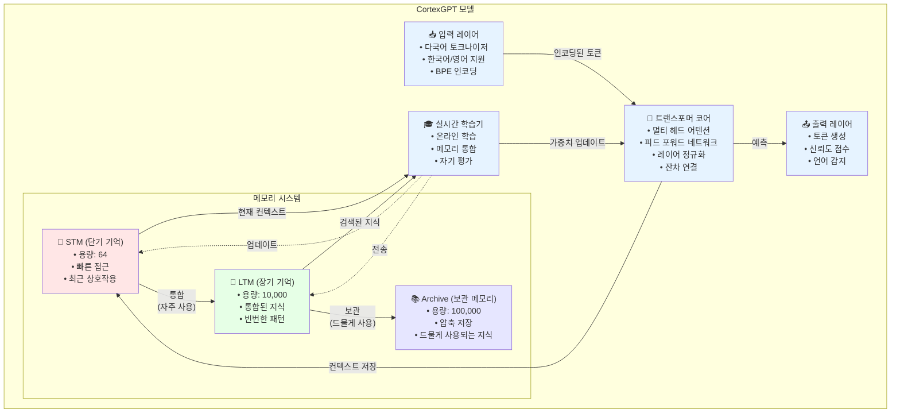

<div align="center">

# 🧠 CortexGPT

**인간 두뇌에서 영감을 받은 실시간 학습 언어 모델**


[English](README.md) | [한국어](#한국어)

</div>

## 한국어

### 🏛️ 아키텍처



### 🌟 핵심 특징

- **실시간 학습**: 훈련/추론 구분 없이 지속적으로 학습
- **인간과 유사한 메모리**: STM(단기) → LTM(장기) → Archive(보관) 시스템
- **자기 개선**: 스스로 평가하고 개선하는 메커니즘
- **다국어 지원**: 한국어와 영어를 자연스럽게 처리
- **메모리 효율성**: OOM 방지를 위한 적응형 배치 크기 조정
- **체크포인트 지원**: 중단 후 훈련 재개 가능
- **BGE-M3 임베딩**: 최첨단 다국어 임베딩 (100개 이상 언어, 기본 활성화)

### 🚀 빠른 시작

#### 1. 설치

```bash
# 저장소 클론
git clone https://github.com/comsa33/cortexgpt.git
cd cortexgpt

# 모든 의존성 설치
uv sync

# 또는 모니터링 도구 포함 설치
uv sync --extra monitoring
```

#### 2. 데모 데이터 생성

```bash
# 데모 훈련 데이터 생성
uv run scripts/data/create_demo_data.py
```

#### 3. 빠른 시작 (추천)

```bash
# 대화형 가이드로 시작
uv run scripts/quick_start.py
```

또는 수동으로:

```bash
# 토크나이저 테스트
uv run tests/demo_tokenizer.py

# 모델 학습 가능 여부 테스트 (과적합 테스트)
uv run tests/test_overfit.py
```

#### 4. 훈련

```bash
# 빠른 데모 훈련 (BGE-M3 임베딩 기본 사용)
uv run scripts/train_cortexgpt.py --dataset demo --epochs 10

# 실제 데이터셋으로 훈련 (다운로드 후)
uv run scripts/train_cortexgpt.py --dataset klue --epochs 20 --wandb

# 중단된 훈련 재개
uv run scripts/train_cortexgpt.py --dataset klue --resume checkpoints/model_best.pt
```

고급 옵션:
```bash
uv run scripts/train_cortexgpt.py --help
```

#### 5. 데모 실행 및 벤치마크

```bash
# 최소 생성 데모
uv run scripts/demos/minimal_demo.py

# 실시간 학습 데모
uv run scripts/demos/learning_effect_demo.py

# 대화형 채팅 데모
uv run scripts/demos/natural_language_demo.py

# 성능 벤치마크
uv run scripts/benchmark.py --checkpoint checkpoints/model_best.pt
```

### 📖 상세 사용 가이드

#### 사전 훈련된 모델 사용하기

```bash
# 훈련된 모델로 텍스트 생성
uv run scripts/generate.py \
    --checkpoint checkpoints/model_best.pt \
    --prompt "인공지능의 미래는" \
    --max-length 100

# 영어 텍스트 생성
uv run scripts/generate.py \
    --checkpoint checkpoints/model_best.pt \
    --prompt "The future of AI is" \
    --temperature 0.8
```

#### 실시간 학습 데모

실시간 학습 데모는 CortexGPT가 상호작용을 통해 어떻게 학습하는지 보여줍니다:

```bash
# 학습 효과 데모 실행
uv run scripts/demos/learning_effect_demo.py
```

이 데모는 다음을 보여줍니다:
- 지식 없이 초기 응답
- 사용자 피드백으로부터 학습
- 학습 후 개선된 응답
- 시간에 따른 메모리 통합

#### 커스텀 훈련

커스텀 데이터셋의 경우, JSONL 파일로 데이터를 생성하세요:

```json
{"text": "여기에 훈련 텍스트를 입력하세요"}
{"text": "또 다른 훈련 예제"}
```

그런 다음 훈련:

```bash
# 커스텀 데이터셋 준비
uv run cortexgpt/data/prepare_custom.py \
    --input your_data.jsonl \
    --output data/custom

# 커스텀 데이터로 훈련
uv run cortexgpt/training/train_realtime.py \
    --dataset custom \
    --vocab-size 30000 \
    --epochs 50
```

#### 메모리 시스템 설정

다양한 사용 사례에 맞게 메모리 시스템 매개변수를 조정하세요:

```bash
# 빠른 실험을 위한 작은 메모리
uv run cortexgpt/training/train_realtime.py \
    --stm-capacity 32 \
    --ltm-capacity 1000 \
    --archive-capacity 10000

# 프로덕션을 위한 큰 메모리
uv run cortexgpt/training/train_realtime.py \
    --stm-capacity 128 \
    --ltm-capacity 50000 \
    --archive-capacity 500000
```

#### API 사용법

```python
from cortexgpt import CortexGPT, MultilingualTokenizer

# 모델과 토크나이저 초기화
model = CortexGPT.from_pretrained("checkpoints/best_model.pt")
tokenizer = MultilingualTokenizer.from_pretrained("checkpoints/tokenizer.json")

# 텍스트 생성
prompt = "기계 학습이란"
inputs = tokenizer.encode(prompt)
outputs = model.generate(inputs, max_length=100)
response = tokenizer.decode(outputs)
print(response)

# 실시간 학습
from cortexgpt.learning import RealTimeLearner

learner = RealTimeLearner(model, tokenizer)
learner.start()  # 백그라운드 학습 시작

# 학습과 함께 쿼리 처리
response, metadata = learner.process_query(
    "기계 학습이란 무엇인가요?",
    learn=True
)
print(f"응답: {response}")
print(f"신뢰도: {metadata['confidence']}")
```

#### 훈련 모니터링

Weights & Biases를 사용하여 상세한 모니터링:

```bash
# 먼저 wandb에 로그인
wandb login

# 모니터링과 함께 훈련
uv run cortexgpt/training/train_realtime.py \
    --dataset klue \
    --wandb \
    --wandb-project "cortexgpt-experiments" \
    --wandb-name "run-001"
```

모니터링 항목:
- 훈련/검증 손실
- 학습률 스케줄
- 메모리 시스템 사용량
- 샘플 생성
- 성능 메트릭

### 🌍 실제 데이터셋으로 훈련하기

#### 1단계: 데이터셋 다운로드

```bash
# 사용 가능한 데이터셋 목록 보기
uv run scripts/download_data.py --list

# 특정 데이터셋 다운로드
uv run scripts/download_data.py --dataset english_large
uv run scripts/download_data.py --dataset korean_large

# 모든 영어 데이터셋 다운로드
uv run scripts/download_data.py --all --category english

# 모든 한국어 데이터셋 다운로드
uv run scripts/download_data.py --all --category korean
```

사용 가능한 데이터셋:
- **영어**: english_small (5K), english_large (50K), wikitext, openwebtext, c4_en
- **한국어**: korean_small (5K), korean_large (50K), klue
- **데모**: demo (1K 샘플)

#### 2단계: 훈련 시작

훈련 스크립트는 JSONL 파일을 자동으로 처리합니다.

#### 3단계: 실제 데이터로 훈련

##### 한국어 데이터셋 (KLUE)
```bash
# KLUE 데이터셋으로 훈련
uv run cortexgpt/training/train_realtime.py \
    --dataset klue \
    --dim 512 \
    --vocab-size 30000 \
    --batch-size 8 \
    --gradient-accumulation 4 \
    --lr 3e-4 \
    --epochs 10 \
    --wandb
```

##### 영어 데이터셋
```bash
# 대규모 영어 데이터로 훈련
uv run cortexgpt/training/train_realtime.py \
    --dataset english_large \
    --dim 512 \
    --vocab-size 30000 \
    --batch-size 8 \
    --gradient-accumulation 4 \
    --lr 3e-4 \
    --epochs 10 \
    --wandb

# 또는 Wikitext 데이터셋 사용
uv run cortexgpt/training/train_realtime.py \
    --dataset wikitext \
    --dim 512 \
    --vocab-size 30000 \
    --batch-size 8 \
    --gradient-accumulation 4 \
    --lr 3e-4 \
    --epochs 10 \
    --wandb
```

##### 한국어-영어 혼합 훈련
```bash
# 먼저 두 데이터셋 다운로드
uv run scripts/download_data.py --dataset english_large
uv run scripts/download_data.py --dataset korean_large

# 결합된 데이터셋으로 훈련 (combined는 klue + english_large 조합)
uv run cortexgpt/training/train_realtime.py \
    --dataset combined \
    --korean-ratio 0.4 \
    --dim 768 \
    --vocab-size 50000 \
    --batch-size 4 \
    --gradient-accumulation 8 \
    --lr 2e-4 \
    --epochs 20 \
    --wandb
```

#### 4단계: 훈련 재개

훈련이 중단된 경우:

```bash
# 최신 체크포인트에서 재개
uv run cortexgpt/training/train_realtime.py \
    --dataset klue \
    --resume auto \
    --wandb

# 특정 체크포인트에서 재개
uv run cortexgpt/training/train_realtime.py \
    --dataset klue \
    --resume checkpoints/realtime/model_best.pt \
    --wandb
```

#### 훈련 팁

1. **작게 시작하기**: 테스트를 위해 `--dim 256`과 `--vocab-size 10000`으로 시작
2. **메모리 모니터링**: OOM 발생 시 `--batch-size 2`를 사용하고 `--gradient-accumulation` 증가
3. **학습률**: 작은 모델은 `1e-3`, 큰 모델은 `3e-4`로 시작
4. **어휘 크기**: 
   - 한국어만: 20,000-30,000
   - 영어만: 30,000-40,000
   - 혼합: 40,000-50,000

#### ⚡ 비동기 멀티프로세싱을 통한 빠른 데이터 로딩

CortexGPT는 이제 비동기 멀티프로세싱을 통해 초고속 데이터 로딩을 지원합니다. 대용량 데이터셋에서 훈련 시작까지 20분 이상 걸리던 문제를 해결했습니다:

```bash
# 훈련 시 자동으로 비동기 로딩을 사용하여 빠르게 시작
uv run cortexgpt/training/train_realtime.py \
    --dataset wikitext \
    --num-workers 4 \
    --batch-size 8 \
    --epochs 10

# 또는 편의 스크립트 사용
uv run scripts/train_with_async.py --wandb
```

특징:
- **병렬 토크나이징**: 여러 워커가 동시에 데이터를 토크나이즈
- **비동기 처리**: 워커가 데이터를 준비하는 동안 메인 프로세스는 계속 진행
- **메모리 효율적**: 모든 데이터를 로드하지 않고 청크 단위로 처리
- **빠른 시작**: 몇 분이 아닌 몇 초 만에 훈련 시작

### 📊 사용 가능한 데이터셋

| 데이터셋 | 언어 | 샘플 수 | 설명 |
|---------|------|---------|------|
| `demo` | 혼합 | 1K | 빠른 테스트용 작은 데이터셋 |
| `english_small` | 영어 | 5K | 소규모 영어 텍스트 |
| `english_large` | 영어 | 50K | 대규모 영어 텍스트 |
| `korean_small` | 한국어 | 5K | 소규모 한국어 텍스트 |
| `korean_large` | 한국어 | 50K | 대규모 한국어 텍스트 |
| `wikitext` | 영어 | 10K | WikiText-103 데이터셋 |
| `openwebtext` | 영어 | 10K | OpenWebText 데이터셋 |
| `c4_en` | 영어 | 5K | C4 영어 데이터셋 |
| `klue` | 한국어 | 10K | 한국어 언어 이해 평가 |
| `combined` | 혼합 | - | 한국어+영어 조합 |

### 🏗️ 프로젝트 구조

```
my-efficient-gpt/
├── cortexgpt/              # 메인 패키지
│   ├── models/            # 모델 아키텍처
│   ├── learning/          # 실시간 학습 시스템
│   ├── tokenization/      # 다국어 토크나이저
│   ├── data/             # 데이터 로딩 유틸리티
│   └── training/         # 훈련 스크립트
├── scripts/
│   ├── data/             # 데이터 준비 스크립트
│   └── demos/            # 데모 애플리케이션
├── tests/                # 테스트 스크립트
├── docs/                 # 문서
└── data/                 # 훈련 데이터
```

### 💡 작동 원리

#### 메모리 흐름
```
새로운 입력 → STM (빠른 접근)
     ↓ (자주 사용)
    LTM (통합된 지식)
     ↓ (오래 미사용)
   Archive (압축 저장)
```

#### 학습 과정
1. **첫 질문**: "아직 학습하지 못한 내용입니다"
2. **학습 후**: 정확한 답변 제공
3. **반복 시**: 신뢰도 증가 (0.6 → 0.9 → 1.0)

### 📈 훈련 옵션

```bash
# 모델 아키텍처
--dim               # 히든 차원 (256/512/768, 기본값: 768)
--vocab-size        # 토크나이저 어휘 크기 (기본값: 50000)

# 훈련 파라미터
--batch-size        # 배치 크기 (기본값: 8)
--gradient-accumulation  # 그래디언트 누적 단계 (기본값: 4)
--epochs           # 에폭 수 (기본값: 10)
--lr              # 학습률 (기본값: 3e-4)

# 메모리 시스템
--stm-capacity     # 단기 기억 용량 (기본값: 64)
--ltm-capacity     # 장기 기억 용량 (기본값: 10000)
--archive-capacity # 보관 용량 (기본값: 100000)

# 임베딩 옵션
--embedding-stage     # BGE-M3 훈련 단계 (1=어댑터만, 2=전체 미세조정)

# 모니터링 및 체크포인팅
--wandb           # Weights & Biases 로깅 활성화
--wandb-project   # W&B 프로젝트 이름
--checkpoint-dir  # 체크포인트 디렉토리
--resume         # 체크포인트에서 재개 (auto/경로)
```

### 🚀 권장 훈련 설정

#### 테스트 및 개발
```bash
# 빠른 테스트를 위한 작은 모델
--dim 256 --lr 1e-3 --batch-size 4 --epochs 20
```

#### 데모 훈련
```bash
# 데모를 위한 중간 모델
--dim 512 --lr 5e-4 --batch-size 8 --gradient-accumulation 4
```

#### 프로덕션 훈련
```bash
# 실제 훈련을 위한 큰 모델
--dim 768 --lr 3e-4 --batch-size 4 --gradient-accumulation 8 --wandb
```

### 🚀 BGE-M3 하이브리드 임베딩 (기본 활성화)

CortexGPT는 우수한 다국어 이해를 위해 최첨단 BGE-M3 임베딩을 기본으로 사용합니다:

#### 특징
- **100개 이상 언어 지원**: 한국어와 영어를 넘어서
- **8192 토큰 컨텍스트**: 확장된 컨텍스트 윈도우
- **다기능성**: 밀집, 희소, 다중 벡터 검색
- **메모리 인식 통합**: CortexGPT의 메모리 시스템과 결합

#### BGE-M3로 훈련하기

```bash
# 1단계: 어댑터만 훈련 (BGE 동결)
uv run scripts/train_cortexgpt.py \
    --dataset klue \
    --bge-stage 1 \
    --epochs 10

# 2단계: 전체 미세조정 (선택사항)
uv run scripts/train_cortexgpt.py \
    --dataset klue \
    --bge-stage 2 \
    --epochs 5 \
    --resume checkpoints/model_best.pt
```

### 🔬 연구 및 개발

CortexGPT는 여러 신경과학 개념을 구현합니다:

- **헤비안 학습**: "함께 발화하는 뉴런은 함께 연결된다"
- **메모리 통합**: STM에서 LTM으로의 점진적 전이
- **선택적 주의**: 관련 정보에 집중
- **지속적 학습**: 잊지 않고 새로운 작업 학습

### 📝 인용

```bibtex
@software{cortexgpt2025,
  author = {Ruo Lee},
  title = {CortexGPT: Real-time Learning Language Model},
  year = {2025},
  email = {comsa333@gmail.com}
}
```

### 📄 라이선스

MIT 라이선스 - 자세한 내용은 [LICENSE](LICENSE) 파일을 참조하세요.

---

Made with ❤️ by Ruo Lee