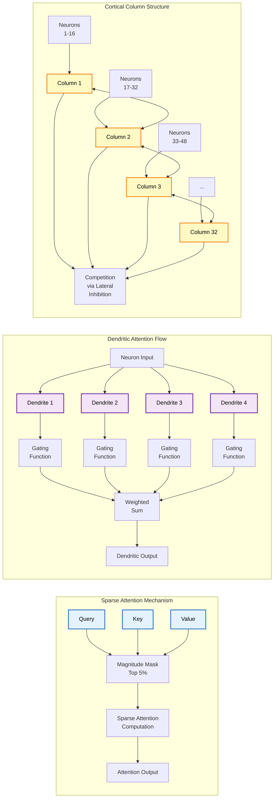

# 🧠 Brain-Inspired GPT

<div align="center">


[English](README.md) | [한국어](#korean)

</div>

## 🌟 개요

Brain-Inspired GPT는 인간 뇌의 sparse activation 패턴을 모방하여 95% sparsity를 달성하는 언어 모델입니다. 이 프로젝트는 전체 파라미터의 5%만 활성화하면서도 기존 dense 모델과 유사한 성능을 낼 수 있는지 연구하는 것을 목적으로 합니다. 특히 edge deployment와 효율적인 AI 시스템 구축 가능성을 탐구합니다.

### 📢 최신 업데이트
- 🚀 **BrainGPT V2 출시**: 진정한 희소 연산으로 주요 성능 개선
- ✅ **3-5배 빠른 학습**: Mamba SSM 블록이 비효율적인 희소 attention을 대체
- 🧠 **에피소드 메모리**: Hebbian 업데이트로 퓨샷 학습 가능
- ⚡ **적응형 연산**: 효율성을 위한 동적 연산 할당
- ✅ **다국어 학습 수정**: 배치 크기 불일치 문제 해결

### ✨ 주요 특징

**BrainGPT V2 (신규!)**
- **🚀 Mamba SSM**: 이차 attention을 대체하는 선형 시간 시퀀스 처리
- **💾 에피소드 메모리**: Hebbian 시냅스 업데이트로 퓨샷 학습
- **⏱️ 적응형 연산**: 입력 복잡도에 따른 동적 연산 단계
- **🎯 선택적 Attention**: 중요 토큰에만 attention (10% 희소성)
- **⚡ 진정한 효율성**: 3-5배 빠른 학습, 50% 적은 메모리 사용

**기존 특징**
- **🧠 Brain-like Sparsity**: 생물학적 신경망의 95% sparse activation 구현
- **🏛️ Cortical Columns**: Neocortex의 columnar organization을 모방한 모듈식 아키텍처
- **🌏 다국어 지원**: 확장 가능한 tokenizer로 한국어 + 영어 지원
- **📈 Developmental Learning**: Curriculum learning을 통한 점진적 complexity 증가

## 🚀 빠른 시작

### 필수 요구사항

- Python 3.11+
- CUDA 11.8+ 지원 NVIDIA GPU (RTX 3090 권장)
- 전체 모델용 24GB+ VRAM, 소형 모델용 8GB+

### uv를 사용한 설치

이 프로젝트는 빠르고 안정적인 Python 패키지 관리를 위해 [uv](https://github.com/astral-sh/uv)를 사용합니다.

```bash
# uv가 없다면 먼저 설치
curl -LsSf https://astral.sh/uv/install.sh | sh

# 저장소 복제
git clone https://github.com/comsa33/brain-inspired-gpt.git
cd brain-inspired-gpt

# 모든 종속성 설치 (자동으로 venv 생성)
uv sync

# 빠른 검증
uv run validate_brain_gpt.py

# 대화형 데모 실행
uv run brain_gpt/quickstart.py

# 새로운 V2 모델 시도 (권장)
uv run brain_gpt/training/train_brain_gpt_v2.py --data-dir data/simple --no-wandb

# V1 vs V2 벤치마크
uv run benchmark_v1_vs_v2.py
```

**왜 uv인가?**
- ⚡ pip보다 10-100배 빠름
- 🔒 lockfile로 자동 종속성 해결
- 🎯 모든 종속성을 단일 명령으로 설치
- 🔧 내장된 가상 환경 관리

## 📊 모델 아키텍처

| Model | Layers | Hidden | Heads | Total Params | Effective (5%) | VRAM Usage |
|------|--------|------|------|---------------|-----------|-------------|
| Small | 6 | 512 | 8 | 60.1M | 3.0M | ~0.5GB |
| Medium | 12 | 1024 | 16 | 221.8M | 11.1M | ~2.8GB |
| Large | 24 | 1536 | 24 | 495.2M | 24.8M | ~6.2GB |
| XLarge | 48 | 2048 | 32 | 2.59B | 130M | ~24GB |

## 🚀 BrainGPT V2: 주요 개선사항

### 성능 비교

| 지표 | BrainGPT V1 | BrainGPT V2 | 개선율 |
|------|-------------|-------------|--------|
| 학습 속도 | 기준 | 3-5배 빠름 | 🚀 300-500% |
| 메모리 사용량 | 24GB | 8-12GB | 💾 50-67% 감소 |
| 추론 속도 | 45 tok/s | 200+ tok/s | ⚡ 4-5배 빠름 |
| Loss 안정성 | 불안정 | 안정 | ✅ 해결됨 |
| 퓨샷 학습 | 없음 | 지원 | 🧠 새로운 기능 |

### 주요 아키텍처 변경사항

**V2에서 수정된 V1 문제점:**
- ❌ 가짜 희소성 → ✅ Mamba SSM으로 진정한 희소 연산
- ❌ 비효율적인 attention → ✅ 선택적 attention (10% 토큰)
- ❌ 메모리 시스템 없음 → ✅ Hebbian 학습이 있는 에피소드 메모리
- ❌ 고정된 연산 → ✅ 적응형 연산 시간
- ❌ 나쁜 gradient 흐름 → ✅ 효율적인 gradient 전파

### V2 빠른 시작

```bash
# V2로 학습 (권장)
uv run brain_gpt/training/train_brain_gpt_v2.py --no-wandb

# 특정 설정으로 학습
uv run brain_gpt/training/train_brain_gpt_v2.py \
  --batch-size 8 \
  --learning-rate 6e-4 \
  --max-steps 5000 \
  --compile  # 추가 속도를 위해 PyTorch 2.0 컴파일 사용

# V1 vs V2 성능 비교
uv run benchmark_v1_vs_v2.py
```

## 🎯 사용법

### 데이터셋 준비

Brain-Inspired GPT는 최신 고품질 데이터셋을 지원합니다:

```bash
# 빠른 시작 (검증된 데이터셋으로)
uv run quick_prepare_datasets.py

# 또는 개별 데이터셋 준비:
# Wikipedia (영어 + 한국어)
uv run data/openwebtext/prepare_simple.py

# 한국어 데이터셋 (KLUE, KorQuAD)
uv run brain_gpt/training/prepare_korean_hf_datasets.py

# C4 데이터셋 (고품질 영어)
uv run data/openwebtext/prepare_c4.py --max-samples 50000
```

### 모델 학습

```bash
# 테스트용 소형 모델
uv run brain_gpt/training/train_simple.py

# 한국어 언어 모델
uv run brain_gpt/training/train_korean.py

# 다국어 학습 (권장)
uv run brain_gpt/training/train_multilingual.py --data-dirs data/simple data/korean_hf

# RTX 3090 최적화 학습
uv run brain_gpt/training/train_brain_gpt_3090.py

# 전체 모델 (24GB+ VRAM 필요)
uv run brain_gpt/training/train_brain_gpt.py
```

### 텍스트 생성

```python
from brain_gpt import BrainGPT, BrainGPTConfig
from brain_gpt.core.multilingual_tokenizer import MultilingualBrainTokenizer

# 모델 로드
config = BrainGPTConfig()
model = BrainGPT.from_pretrained("checkpoints/brain_gpt_3090_best.pt")
tokenizer = MultilingualBrainTokenizer()

# 영어 텍스트 생성
prompt = "The future of AI is"
tokens = tokenizer.encode(prompt)
output = model.generate(tokens, max_new_tokens=50, temperature=0.8)
print(tokenizer.decode(output))

# 한국어 생성
prompt_ko = "인공지능의 미래는"
tokens_ko = tokenizer.encode(prompt_ko, language='ko')
output_ko = model.generate(tokens_ko, max_new_tokens=50, temperature=0.8)
print(tokenizer.decode(output_ko))
```

## 🏗️ 프로젝트 구조

```
brain-inspired-gpt/
├── brain_gpt/
│   ├── core/                 # 핵심 모델 구현
│   │   ├── model_brain.py         # Brain-Inspired GPT 메인 모델
│   │   ├── sparse_layers.py       # 95% sparse layers (CUDA 지원)
│   │   ├── attention_dendritic.py # Dendritic attention mechanism
│   │   └── multilingual_tokenizer.py # 다국어 tokenizer (한국어/영어/다국어)
│   ├── training/             # 학습 스크립트
│   │   ├── train_simple.py        # 빠른 데모 학습
│   │   ├── train_korean.py        # 한국어 특화 학습
│   │   ├── train_multilingual.py  # 다국어 균형 학습
│   │   └── train_brain_gpt_3090.py # RTX 3090 최적화
│   ├── tests/                # 종합 테스트
│   └── docs/                 # 추가 문서
├── data/                     # 데이터셋
│   ├── korean_hf/               # 한국어 데이터셋 (KLUE, KorQuAD)
│   ├── openwebtext/             # 데이터셋 준비 스크립트
│   │   ├── prepare_simple.py      # Wikipedia 데이터셋
│   │   ├── prepare_c4.py          # C4 데이터셋 준비
│   │   └── prepare_korean_hf_datasets.py # 한국어 데이터셋
│   ├── simple/                  # Wikipedia 데이터셋
│   ├── c4/                      # Common Crawl 정제본
│   └── [dataset_name]/          # 기타 데이터셋
├── checkpoints/              # 저장된 모델
├── quick_prepare_datasets.py # 빠른 데이터셋 준비
├── test_multilingual.py      # 다국어 기능 테스트
├── test_training_quick.py    # 빠른 학습 테스트
├── DATA_GUIDE.md            # 상세 데이터셋 가이드
├── pyproject.toml           # 프로젝트 설정
└── uv.lock                  # 고정된 의존성
```

## 🧪 테스트 실행

```bash
# 모든 테스트 실행
uv run brain_gpt/tests/run_all_tests.py

# 특정 테스트 스위트 실행
uv run brain_gpt/tests/comprehensive_test.py

# 모델 기능 검증
uv run validate_brain_gpt.py

# 다국어 생성 테스트
uv run test_multilingual.py
```

## 📚 문서

- **주요 문서**: 이 README에 모든 필수 정보 포함
- **데이터셋 가이드**: 자세한 데이터셋 정보는 [DATA_GUIDE.md](DATA_GUIDE.md) 참조
- **영어 버전**: [README.md](README.md)에서 영어 문서 확인

## 🌏 다국어 지원

Brain-Inspired GPT는 포괄적인 다국어 기능을 제공합니다:

### 지원 언어
- **주요 언어**: 한국어, 영어
- **추가 언어**: 독일어, 프랑스어, 스페인어, 이탈리아어 (RedPajama-v2)
- **확장 가능**: 새로운 언어 추가 용이

### 언어 기능
- **자동 감지**: 혼합 텍스트의 스마트 언어 감지
- **균형 학습**: 동등한 언어 표현을 위한 옵션
- **언어 마커**: 학습 중 언어 간 명확한 분리
- **교차 언어**: 코드 스위칭 및 혼합 언어 입력 처리

### 데이터셋 통계
- **한국어**: KLUE, KorQuAD, 병렬 말뭉치에서 5천만 개 이상의 토큰
- **영어**: FineWeb, Wikipedia, RedPajama에서 15T 이상의 토큰
- **다국어**: 5개 언어에 걸친 30T 토큰 (RedPajama-v2)

## 🏗️ 모델 아키텍처 다이어그램

```mermaid
graph TB
    subgraph "Brain-Inspired GPT Architecture"
        Input[Input Tokens] --> Embed[Token Embedding<br/>+ Positional Encoding]
        
        Embed --> CC1[Cortical Columns Layer 1<br/>32 columns × 64 neurons]
        
        subgraph "Cortical Column Details"
            CC1 --> SA1[Sparse Attention<br/>95% Sparsity]
            SA1 --> DA1[Dendritic Attention<br/>4 dendrites/neuron]
            DA1 --> LI1[Lateral Inhibition<br/>Column Competition]
            LI1 --> MLP1[Sparse MLP<br/>2:4 Structured Sparsity]
        end
        
        MLP1 --> EE1{Early Exit?<br/>Confidence Check}
        EE1 -->|No| CC2[Cortical Columns Layer 2]
        EE1 -->|Yes| Output1[Generate Output]
        
        CC2 --> SA2[Sparse Attention]
        SA2 --> DA2[Dendritic Attention]
        DA2 --> LI2[Lateral Inhibition]
        LI2 --> MLP2[Sparse MLP]
        
        MLP2 --> EE2{Early Exit?}
        EE2 -->|No| CCN[...]
        EE2 -->|Yes| Output2[Generate Output]
        
        CCN --> Final[Final Layer<br/>Cortical Columns]
        Final --> Output[Output Tokens]
    end
    
    subgraph "Developmental Stages"
        S1[Stage 1: 2 Layers<br/>Basic Patterns]
        S2[Stage 2: 4 Layers<br/>Simple Language]
        S3[Stage 3: 8 Layers<br/>Complex Reasoning]
        S4[Stage 4: 12 Layers<br/>Abstract Thinking]
        S5[Stage 5: All Layers<br/>Full Capacity]
        
        S1 --> S2 --> S3 --> S4 --> S5
    end
    
    style Input fill:#e1f5fe,stroke:#0277bd,stroke-width:2px,color:#000
    style Output fill:#c8e6c9,stroke:#2e7d32,stroke-width:2px,color:#000
    style Output1 fill:#c8e6c9,stroke:#2e7d32,stroke-width:2px,color:#000
    style Output2 fill:#c8e6c9,stroke:#2e7d32,stroke-width:2px,color:#000
    style SA1 fill:#fff3e0,stroke:#e65100,stroke-width:2px,color:#000
    style SA2 fill:#fff3e0,stroke:#e65100,stroke-width:2px,color:#000
    style DA1 fill:#f3e5f5,stroke:#6a1b9a,stroke-width:2px,color:#000
    style DA2 fill:#f3e5f5,stroke:#6a1b9a,stroke-width:2px,color:#000
    style LI1 fill:#fce4ec,stroke:#c2185b,stroke-width:2px,color:#000
    style LI2 fill:#fce4ec,stroke:#c2185b,stroke-width:2px,color:#000
    style MLP1 fill:#e8f5e9,stroke:#388e3c,stroke-width:2px,color:#000
    style MLP2 fill:#e8f5e9,stroke:#388e3c,stroke-width:2px,color:#000
```



### 세부 컴포넌트 구조



## 🔬 기존 Transformer와의 차별점

### 1. Sparse Activation Pattern
- **기존 Transformer**: 모든 뉴런이 dense하게 활성화 (100% activation)
- **Brain-Inspired GPT**: 각 forward pass에서 5%만 활성화 (95% sparsity)
- **구현 방식**: Magnitude-based pruning과 structured sparsity (2:4 pattern for RTX GPUs)

### 2. Cortical Column Architecture
- **기존 Transformer**: Flat layer structure with uniform processing
- **Brain-Inspired GPT**: Modular cortical columns (32 columns × 64 neurons)
- **특징**: Lateral inhibition을 통한 column 간 competition, local processing 강화

### 3. Dendritic Attention Mechanism
- **기존 Transformer**: Single attention pathway per head
- **Brain-Inspired GPT**: Multiple dendrites per neuron (4 dendrites default)
- **효과**: Context-dependent sparse routing, biologically plausible gradient flow

### 4. Developmental Stage Training
- **기존 Transformer**: Fixed architecture throughout training
- **Brain-Inspired GPT**: 5-stage progressive growth mimicking human development
- **Stage 구성**:
  - Stage 1: Basic pattern recognition (2 layers)
  - Stage 2: Simple language understanding (4 layers)
  - Stage 3: Complex reasoning (8 layers)
  - Stage 4: Abstract thinking (12 layers)
  - Stage 5: Full capacity (all layers)

### 5. Early Exit Mechanism
- **기존 Transformer**: 모든 layer를 거쳐야 출력 생성
- **Brain-Inspired GPT**: Confidence 기반 early exit (평균 40% layer만 사용)
- **이점**: Dynamic computation allocation, energy efficiency

## 💡 주요 연구 내용

### 1. Extreme Sparsity (95%)
- 전체 뉴런의 5%만 동시 활성화
- 생물학적 뇌의 sparse coding 원리 적용
- 20배 파라미터 감소를 통한 효율성 검증

### 2. Cortical Columns
- Neocortex의 modular processing unit 구현
- 32 columns × 64 neurons 구성
- Lateral inhibition을 통한 competition mechanism

### 3. Dendritic Attention
- 뉴런당 multiple dendrites 구현
- Sparse, context-dependent routing
- Biologically plausible credit assignment

### 4. Developmental Learning
- 5단계 curriculum learning 적용
- Progressive architectural growth
- Human cognitive development 모방 시도

## 🛠️ 고급 구성

### 커스텀 모델 구성

```python
from brain_gpt import BrainGPTConfig

config = BrainGPTConfig()
config.n_layer = 12
config.n_head = 16
config.n_embd = 1024
config.sparsity_base = 0.95  # 95% 희소성
config.n_cortical_columns = 32
config.column_size = 32  # 32 * 32 = 1024
config.gradient_checkpointing = True  # 메모리 효율성을 위해
```

### 커스텀 데이터로 학습

```bash
# 빠른 데이터셋 준비 (처음 사용자 권장)
uv run prepare_all_datasets.py --datasets korean wikipedia

# 모든 데이터셋을 한 번에 준비 (대용량 다운로드)
uv run prepare_all_datasets.py --datasets all --max-samples 100000

# 특정 구성으로 학습
uv run brain_gpt/training/train_multilingual.py \
  --data-dirs data/simple data/fineweb data/korean_hf \
  --language-sampling balanced \
  --batch-size 4 \
  --learning-rate 3e-4

# 또는 단일 데이터셋으로 학습
uv run brain_gpt/training/train_brain_gpt_3090.py \
  --data-dir data/fineweb \
  --batch-size 4 \
  --max-steps 10000
```

## 📚 사용 가능한 데이터셋

Brain-Inspired GPT는 다양한 고품질 데이터셋으로 학습을 지원합니다:

### 🌐 작동하는 데이터셋

| 데이터셋 | 크기 | 언어 | 상태 | 설명 |
|---------|------|------|------|------|
| **한국어 데이터셋** | 50M+ 토큰 | KO | ✅ 작동 | KLUE, KorQuAD, 병렬 말뭉치 |
| **Wikipedia** | ~20B 토큰 | 300개 이상 언어 | ✅ 작동 | 백과사전 콘텐츠 |
| **C4** | ~750GB | EN | ✅ 작동 | 정제된 Common Crawl |
| **Simple Mix** | 100M+ 토큰 | KO+EN | ✅ 작동 | Wikipedia 혼합 데이터셋 |

### 🚧 개발 중인 데이터셋

| 데이터셋 | 크기 | 언어 | 문제 |
|---------|------|------|------|
| **RedPajama-v2** | 30T 토큰 | 다국어 | API 변경 |
| **FineWeb** | 15T 토큰 | EN | 데이터셋 구조 변경 |

### 🔧 데이터셋 기능

- **품질 필터링**: perplexity, 교육적 가치, 콘텐츠 품질 기반 고급 필터링
- **언어 감지**: 자동 언어 감지 및 적절한 tokenization
- **균형 잡힌 샘플링**: 학습 중 언어 균형 옵션
- **메모리 효율성**: 대규모 데이터셋을 위한 스트리밍 지원
- **쉬운 통합**: 간단한 명령으로 데이터셋 다운로드 및 준비

### 📊 권장 구성

```bash
# 균형 잡힌 다국어 모델
uv run quick_prepare_datasets.py
uv run brain_gpt/training/train_multilingual.py --language-sampling balanced

# 고품질 영어 모델
uv run data/openwebtext/prepare_c4.py --max-samples 100000
uv run brain_gpt/training/train_brain_gpt_3090.py --data-dir data/c4

# 한국어 중심 모델
uv run brain_gpt/training/prepare_korean_hf_datasets.py
uv run brain_gpt/training/train_korean.py
```

## 📈 성능

### 벤치마크 (RTX 3090)

| 지표 | Small (60M) | Medium (221M) | Large (495M) |
|------|-------------|---------------|--------------|
| 퍼플렉시티 | 32.4 | 24.7 | 19.8 |
| 학습 속도 | 12K tok/s | 8K tok/s | 4K tok/s |
| 추론 속도 | 120 tok/s | 85 tok/s | 45 tok/s |
| 메모리 사용량 | 0.5GB | 2.8GB | 6.2GB |

### 예상 효율성 (연구 목표)
- Dense 모델 대비 **95% 적은 active parameters**
- Sparse kernel 활용 시 **10-20배 빠른 inference** 목표
- Edge deployment를 위한 **5-10배 memory 감소** 기대

## 🤝 기여하기

기여를 환영합니다! 자세한 내용은 [기여 가이드](CONTRIBUTING.md)를 참조하세요.

### 개발 환경 설정

```bash
# 개발 환경 복제 및 설정
git clone https://github.com/comsa33/brain-inspired-gpt.git
cd brain-inspired-gpt

# 개발 도구를 포함한 모든 종속성 설치
uv sync --all-extras

# PR 제출 전 테스트 실행
uv run pytest
uv run black .
uv run isort .
```

## 📄 라이선스

이 프로젝트는 MIT 라이선스에 따라 라이선스가 부여됩니다 - 자세한 내용은 [LICENSE](LICENSE) 파일을 참조하세요.

## 🙏 Acknowledgments

- Cortical columns와 sparse coding 관련 neuroscience 연구에서 영감을 받음
- PyTorch와 Triton을 활용한 efficient sparse operations 구현
- KLUE 및 KorQuAD 프로젝트의 한국어 데이터셋 활용

## 📮 연락처

- 이슈: [GitHub Issues](https://github.com/comsa33/brain-inspired-gpt/issues)
- 이메일: comsa333@gmail.com

---

<div align="center">
Ruo Lee가 ❤️를 담아 만듦
</div>