<div align="center">

# 🧠 CortexGPT

**인간 두뇌에서 영감을 받은 실시간 학습 언어 모델**


[English](README.md) | [한국어](#한국어)

</div>

## 한국어

### 📖 CortexGPT 소개

CortexGPT는 인간의 뇌 학습 메커니즘을 모방한 혁신적인 언어 모델입니다. 기존 모델들이 훈련과 추론을 별도로 수행하는 것과 달리, CortexGPT는 인간처럼 실시간으로 지속적으로 학습합니다. 단기 기억(STM), 장기 기억(LTM), 보관 메모리(Archive)로 구성된 생물학적 영감을 받은 메모리 시스템을 특징으로 하며, 모든 상호작용에서 학습하고 기억하면서 지식을 효율적으로 관리합니다.

주요 혁신:
- **실시간 지속 학습** - 훈련/추론 구분 없이 계속 학습
- **인간과 유사한 메모리 계층** - 효율적인 지식 관리
- **경험 기반 자기 개선 메커니즘** - 상호작용을 통해 성능 향상
- **네이티브 다국어 지원** - BGE-M3 임베딩으로 100개 이상 언어 지원
- **초고속 데이터 로딩** - 비동기 멀티프로세싱으로 즉시 훈련 시작
- **향상된 안정성** - 온도 제어 메모리 게이팅 (Phase 1)
- **뇌과학 기반 기능** - 항상성 가소성 및 수면-각성 주기 포함 (Phase 2)
- **35배 성능 향상** - GPU 가속 메모리 및 고급 인지 기능 (Phase 3)

### 🏛️ 아키텍처

```mermaid
graph TB
    subgraph "CortexGPT 모델"
        Input["📥 입력 레이어<br/>• 다국어 토크나이저<br/>• 한국어/영어 지원<br/>• BPE 인코딩"]
        
        Transformer["🤖 트랜스포머 코어<br/>• 멀티 헤드 어텐션<br/>• 피드 포워드 네트워크<br/>• 레이어 정규화<br/>• 잔차 연결"]
        
        subgraph "메모리 시스템"
            STM["💭 STM (단기 기억)<br/>• 용량: 64<br/>• 빠른 접근<br/>• 최근 상호작용"]
            LTM["🧠 LTM (장기 기억)<br/>• 용량: 10,000<br/>• 통합된 지식<br/>• 빈번한 패턴"]
            Archive["📚 Archive (보관 메모리)<br/>• 용량: 100,000<br/>• 압축 저장<br/>• 드물게 사용되는 지식"]
        end
        
        Learner["🎓 실시간 학습기<br/>• 온라인 학습<br/>• 메모리 통합<br/>• 자기 평가"]
        
        Output["📤 출력 레이어<br/>• 토큰 생성<br/>• 신뢰도 점수<br/>• 언어 감지"]
    end
    
    Input --> |"인코딩된 토큰"| Transformer
    Transformer --> |"컨텍스트 저장"| STM
    STM --> |"통합<br/>(자주 사용)"| LTM
    LTM --> |"보관<br/>(드물게 사용)"| Archive
    STM --> |"현재 컨텍스트"| Learner
    LTM --> |"검색된 지식"| Learner
    Learner --> |"가중치 업데이트"| Transformer
    Transformer --> |"예측"| Output
    Learner -.-> |"업데이트"| STM
    Learner -.-> |"전송"| LTM
    
    style Input fill:#e6f3ff,stroke:#333,stroke-width:2px,color:#000
    style Transformer fill:#e6f3ff,stroke:#333,stroke-width:2px,color:#000
    style STM fill:#ffe6e6,stroke:#333,stroke-width:2px,color:#000
    style LTM fill:#e6ffe6,stroke:#333,stroke-width:2px,color:#000
    style Archive fill:#e6e6ff,stroke:#333,stroke-width:2px,color:#000
    style Learner fill:#e6f3ff,stroke:#333,stroke-width:2px,color:#000
    style Output fill:#e6f3ff,stroke:#333,stroke-width:2px,color:#000
```



### 🌟 핵심 특징

- **실시간 학습**: 훈련/추론 구분 없이 지속적으로 학습
- **인간과 유사한 메모리**: STM(단기) → LTM(장기) → Archive(보관) 시스템
- **자기 개선**: 스스로 평가하고 개선하는 메커니즘
- **다국어 지원**: 한국어와 영어를 자연스럽게 처리
- **메모리 효율성**: OOM 방지를 위한 적응형 배치 크기 조정
- **체크포인트 지원**: 중단 후 훈련 재개 가능
- **BGE-M3 임베딩**: 최첨단 다국어 임베딩 (100개 이상 언어, 기본 활성화)

#### 🆕 최신 개선사항 (v2.0)

**Phase 1 - 훈련 안정성**:
- 온도 제어 메모리 게이팅으로 승자독식 현상 방지
- 메모리 검색에서 그래디언트 중단으로 피드백 루프 제거
- 손실 급증 감지 및 자동 복구
- Gumbel-Softmax를 사용한 부드러운 희소성으로 매끄러운 그래디언트

**Phase 2 - neuroscience 기반 기능**:
- 안정적인 뉴런 발화율을 위한 항상성 가소성
- 수면-각성 통합 주기 (각성/NREM/REM 단계)
- 보완 학습 시스템 (빠른 해마 vs 느린 신피질)
- BCM 학습 규칙을 사용한 메타가소성

**Phase 3 - 성능 최적화**:
- FAISS를 사용한 GPU 가속 메모리 (35배 속도 향상: 3019.4 토큰/초)
- 스레드 풀을 사용한 비동기 메모리 작업
- 경험 시퀀스를 위한 에피소드 메모리
- 작업별 게이트가 있는 작업 메모리
- 계층적 메모리 압축
- 고급 인지 기능 (유추, 인과 추론, 개념 학습)

### 🚀 빠른 시작

> **📖 CortexGPT가 처음이신가요?** 자세한 안내와 best practices는 [Training Guide](TRAINING_GUIDE.md)를 확인하세요!

#### 1. 설치

```bash
# 저장소 클론
git clone https://github.com/comsa33/cortexgpt.git
cd cortexgpt

# 모든 의존성 설치
uv sync

# 또는 모니터링 도구 포함 설치
uv sync --extra monitoring
```

#### 2. 데모 데이터 생성

```bash
# 데모 훈련 데이터 생성
uv run scripts/data/create_demo_data.py
```

#### 3. 빠른 시작 (추천)

```bash
# 대화형 가이드로 시작
uv run scripts/quick_start.py
```

또는 수동으로:

```bash
# 토크나이저 테스트
uv run tests/demo_tokenizer.py

# 모델 학습 가능 여부 테스트 (과적합 테스트)
uv run tests/test_overfit.py
```

#### 4. 훈련 (v2.0 업데이트)

##### 준비된 바이너리 데이터 사용 (권장)
```bash
# 기본 샘플 데이터로 빠른 데모 훈련
uv run scripts/train_cortexgpt.py --epochs 10 --batch-size 8

# 특정 데이터 파일 지정
uv run scripts/train_cortexgpt.py \
    --train-data data/sample_train.bin \
    --val-data data/sample_val.bin \
    --epochs 10

# 최소 모드 (모든 고급 기능 비활성화)
uv run scripts/train_cortexgpt.py --minimal --epochs 5 --batch-size 16

# KLUE 한국어 데이터셋으로 훈련
uv run scripts/train_cortexgpt.py \
    --train-data data/datasets/klue/prepared/train.bin \
    --val-data data/datasets/klue/prepared/val.bin \
    --epochs 20 --wandb

# 고급 뇌과학 기능 (높은 메모리 사용 - RTX 3090은 아래 참조)
uv run scripts/train_cortexgpt.py \
    --enable-homeostasis \
    --enable-sleep-wake \
    --consolidation-cycle 1000 \
    --epochs 20

# GPU 가속 성능 모드
uv run scripts/train_cortexgpt.py \
    --use-gpu-memory \
    --async-memory \
    --enable-episodic \
    --enable-working \
    --epochs 20

# 중단된 훈련 재개
uv run scripts/train_cortexgpt.py \
    --resume checkpoints/cortex_unified/cortex_gpt_best.pt
```

##### JSONL에서 데이터 준비
```bash
# JSONL을 바이너리 형식으로 변환
uv run cortexgpt/data/prepare_data.py \
    --input-file data/train.jsonl \
    --output-file data/custom_train.bin \
    --tokenizer gpt2

# 준비된 데이터로 훈련
uv run scripts/train_cortexgpt.py \
    --train-data data/custom_train.bin \
    --val-data data/custom_val.bin \
    --epochs 10
```

고급 옵션:
```bash
uv run scripts/train_cortexgpt.py --help
```

#### 5. 데모 실행 및 벤치마크

```bash
# 최소 생성 데모
uv run scripts/demos/minimal_demo.py

# 실시간 학습 데모
uv run scripts/demos/learning_effect_demo.py

# 대화형 채팅 데모
uv run scripts/demos/natural_language_demo.py

# 성능 벤치마크
uv run scripts/benchmark.py --checkpoint checkpoints/model_best.pt
```

### 📖 상세 사용 가이드

#### 사전 훈련된 모델 사용하기

```bash
# 통합 모델로 텍스트 생성
uv run scripts/generate.py \
    --checkpoint checkpoints/cortex_unified/cortex_gpt_best.pt \
    --prompt "인공지능의 미래는" \
    --max-length 100

# 영어 텍스트 생성
uv run scripts/generate.py \
    --checkpoint checkpoints/cortex_unified/cortex_gpt_best.pt \
    --prompt "The future of AI is" \
    --temperature 0.8

# 기존 체크포인트 사용 (호환 가능)
uv run scripts/generate.py \
    --checkpoint checkpoints/model_best.pt \
    --prompt "안녕하세요" \
    --temperature 0.7
```

#### 실시간 학습 데모

실시간 학습 데모는 CortexGPT가 상호작용을 통해 어떻게 학습하는지 보여줍니다:

```bash
# 학습 효과 데모 실행
uv run scripts/demos/learning_effect_demo.py
```

이 데모는 다음을 보여줍니다:
- 지식 없이 초기 응답
- 사용자 피드백으로부터 학습
- 학습 후 개선된 응답
- 시간에 따른 메모리 통합

#### 커스텀 훈련

커스텀 데이터셋의 경우, JSONL 파일로 데이터를 생성하세요:

```json
{"text": "여기에 훈련 텍스트를 입력하세요"}
{"text": "또 다른 훈련 예제"}
```

그런 다음 훈련:

```bash
# 커스텀 데이터셋 준비
uv run cortexgpt/data/prepare_custom.py \
    --input your_data.jsonl \
    --output data/custom

# 커스텀 데이터로 훈련
uv run scripts/train_cortexgpt.py \
    --train-data data/custom/train.bin \
    --val-data data/custom/val.bin \
    --vocab-size 50257 \
    --epochs 50
```

#### 메모리 시스템 설정

다양한 사용 사례에 맞게 메모리 시스템 매개변수를 조정하세요:

```bash
# 빠른 실험을 위한 작은 메모리
uv run scripts/train_cortexgpt.py \
    --stm-capacity 32 \
    --ltm-dim 128 \
    --episodic-capacity 1000 \
    --batch-size 8 --epochs 10

# 프로덕션을 위한 큰 메모리
uv run scripts/train_cortexgpt.py \
    --stm-capacity 256 \
    --ltm-dim 512 \
    --episodic-capacity 50000 \
    --working-memory-slots 16 \
    --batch-size 4 --epochs 20
```

#### API 사용법

```python
import torch
from cortexgpt.models.cortex_gpt import CortexGPT, UnifiedCortexConfig
from cortexgpt.tokenization import MultilingualTokenizer

# 통합 모델 초기화
config = UnifiedCortexConfig()
model = CortexGPT(config, vocab_size=50257, dim=768)

# 체크포인트 로드
checkpoint = torch.load("checkpoints/cortex_unified/cortex_gpt_best.pt")
model.load_state_dict(checkpoint['model_state_dict'])

# 토크나이저 초기화
tokenizer = MultilingualTokenizer(vocab_size=50257)

# 텍스트 생성
prompt = "기계 학습이란"
input_ids = tokenizer.encode(prompt)
output = model.generate(input_ids, max_length=100)
response = tokenizer.decode(output)
print(response)

# 모델 통계 확인
stats = model.get_stats()
print(f"메모리 사용률: {stats['stm_usage']:.2%}")
print(f"활성 컬럼: {stats['active_columns']}")
```

#### 훈련 모니터링

Weights & Biases를 사용하여 상세한 모니터링:

```bash
# 먼저 wandb에 로그인
wandb login

# 모니터링과 함께 훈련
uv run scripts/train_cortexgpt.py \
    --train-data data/datasets/klue/prepared/train.bin \
    --val-data data/datasets/klue/prepared/val.bin \
    --wandb \
    --wandb-project "cortex-gpt-unified" \
    --wandb-entity "your-entity"
```

모니터링 항목:
- 훈련/검증 손실
- 학습률 스케줄
- 메모리 시스템 사용량
- 샘플 생성
- 성능 메트릭

### 🌍 실제 데이터셋으로 훈련하기

#### 1단계: 데이터셋 다운로드

```bash
# 사용 가능한 데이터셋 목록 보기
uv run scripts/download_data.py --list

# 특정 데이터셋 다운로드
uv run scripts/download_data.py --dataset english_large
uv run scripts/download_data.py --dataset korean_large

# 모든 영어 데이터셋 다운로드
uv run scripts/download_data.py --all --category english

# 모든 한국어 데이터셋 다운로드
uv run scripts/download_data.py --all --category korean
```

사용 가능한 데이터셋:
- **영어**: english_small (5K), english_large (50K), wikitext, openwebtext, c4_en
- **한국어**: korean_small (5K), korean_large (50K), klue
- **데모**: demo (1K 샘플)

#### 2단계: 데이터 준비

훈련 스크립트는 바이너리(.bin) 파일을 기대합니다. JSONL 파일이 있다면 먼저 변환해야 합니다.

#### 3단계: 실제 데이터로 훈련

##### 한국어 데이터셋 (KLUE)
```bash
# KLUE 데이터셋으로 훈련 (통합 트레이너 사용)
uv run scripts/train_cortexgpt.py \
    --train-data data/datasets/klue/prepared/train.bin \
    --val-data data/datasets/klue/prepared/val.bin \
    --dim 512 \
    --batch-size 8 \
    --gradient-accumulation 4 \
    --lr 3e-4 \
    --epochs 10 \
    --wandb
```

##### 영어 데이터셋
```bash
# 먼저 데이터 준비
uv run cortexgpt/data/prepare_data.py \
    --input-file data/datasets/english_large/data.jsonl \
    --output-file data/datasets/english_large/prepared/train.bin

# 대규모 영어 데이터로 훈련
uv run scripts/train_cortexgpt.py \
    --train-data data/datasets/english_large/prepared/train.bin \
    --val-data data/datasets/english_large/prepared/val.bin \
    --dim 512 \
    --batch-size 8 \
    --gradient-accumulation 4 \
    --lr 3e-4 \
    --epochs 10 \
    --wandb
```

##### 한국어-영어 혼합 훈련
```bash
# 먼저 두 데이터셋 다운로드
uv run scripts/download_data.py --dataset english_large
uv run scripts/download_data.py --dataset korean_large

# 먼저 결합된 데이터셋 준비
uv run cortexgpt/data/prepare_multilingual.py \
    --korean-data data/datasets/klue/data.jsonl \
    --english-data data/datasets/english_large/data.jsonl \
    --output-dir data/datasets/combined/prepared \
    --korean-ratio 0.4

# 결합된 데이터셋으로 훈련
uv run scripts/train_cortexgpt.py \
    --train-data data/datasets/combined/prepared/train.bin \
    --val-data data/datasets/combined/prepared/val.bin \
    --dim 768 \
    --vocab-size 50257 \
    --batch-size 4 \
    --gradient-accumulation 8 \
    --lr 2e-4 \
    --epochs 20 \
    --wandb
```

#### 4단계: 훈련 재개

훈련이 중단된 경우:

```bash
# 특정 체크포인트에서 재개
uv run scripts/train_cortexgpt.py \
    --train-data data/datasets/klue/prepared/train.bin \
    --val-data data/datasets/klue/prepared/val.bin \
    --resume checkpoints/cortex_unified/cortex_gpt_best.pt \
    --wandb

# 동일한 설정으로 재개
uv run scripts/train_cortexgpt.py \
    --train-data data/datasets/klue/prepared/train.bin \
    --val-data data/datasets/klue/prepared/val.bin \
    --resume checkpoints/cortex_unified/cortex_gpt_epoch_10.pt \
    --epochs 20  # 10 에포크 추가 훈련
```

#### 훈련 팁

1. **작게 시작하기**: 테스트를 위해 `--dim 256`과 `--vocab-size 10000`으로 시작
2. **메모리 모니터링**: OOM 발생 시 `--batch-size 2`를 사용하고 `--gradient-accumulation` 증가
3. **학습률**: 작은 모델은 `1e-3`, 큰 모델은 `3e-4`로 시작
4. **어휘 크기**: 
   - 한국어만: 20,000-30,000
   - 영어만: 30,000-40,000
   - 혼합: 40,000-50,000

#### ⚡ 비동기 멀티프로세싱을 통한 빠른 데이터 로딩

CortexGPT는 이제 비동기 멀티프로세싱을 통해 초고속 데이터 로딩을 지원합니다. 대용량 데이터셋에서 훈련 시작까지 20분 이상 걸리던 문제를 해결했습니다:

```bash
# 훈련 시 자동으로 비동기 로딩을 사용하여 빠르게 시작
uv run scripts/train_cortexgpt.py \
    --train-data data/datasets/wikitext/prepared/train.bin \
    --val-data data/datasets/wikitext/prepared/val.bin \
    --num-workers 4 \
    --batch-size 8 \
    --epochs 10
```

특징:
- **병렬 토크나이징**: 여러 워커가 동시에 데이터를 토크나이즈
- **비동기 처리**: 워커가 데이터를 준비하는 동안 메인 프로세스는 계속 진행
- **메모리 효율적**: 모든 데이터를 로드하지 않고 청크 단위로 처리
- **빠른 시작**: 몇 분이 아닌 몇 초 만에 훈련 시작

### 🎯 v2.0의 중요한 변경사항

#### 데이터 형식
- **바이너리 형식 필요**: 통합 트레이너는 JSONL이 아닌 `.bin` 파일을 기대합니다
- **데이터 준비**: JSONL을 바이너리 형식으로 변환하려면 `prepare_data.py` 사용
- **직접 경로 지정**: `--dataset` 대신 `--train-data`와 `--val-data` 사용

#### 체크포인트 위치
- **새 위치**: `checkpoints/` 대신 `checkpoints/cortex_unified/`
- **명명 규칙**: `cortex_gpt_best.pt`, `cortex_gpt_epoch_N.pt`
- **하위 호환성**: 기존 체크포인트도 로드 가능

#### 기본 동작
- **모든 Phase 활성화**: Phase 1-3 기능이 기본적으로 활성화됨
- **GPU 메모리**: 사용 가능한 경우 자동으로 GPU 가속 사용
- **최소 모드**: 모든 고급 기능을 비활성화하려면 `--minimal` 사용

#### 🚀 신규: 최적화된 Training (v2.1)

**더 빠르고 효율적인 training을 위한 주요 개선사항:**
- **Learning rate 문제 해결** - 이전 버전은 learning rate가 1000배 작았음
- **Data loading 최적화** - 적절한 multi-worker 설정으로 20배 빠름
- **스마트 GPU 감지** - 하드웨어에 맞게 자동 설정

```bash
# 추천: 최적화된 설정으로 빠른 training
uv run scripts/train.py --mode fast --epochs 10 --wandb

# Custom data 사용시
uv run scripts/train.py \
    --train-data data/your_train.bin \
    --val-data data/your_val.bin \
    --mode fast \
    --epochs 10
```

**자동 감지 GPU 설정 (수정된 learning rate 포함):**
- **RTX 3090** (24GB): Batch 12, dim 512, LR 1e-4, 8 workers
- **RTX 3080** (10GB): Batch 8, dim 384, LR 1e-4, 6 workers
- **RTX 3070** (8GB): Batch 4, dim 256, LR 1e-4, 4 workers
- **기타 GPU**: 사용 가능한 memory에 따라 자동 설정

**메모리 최적화 기능:**
- 더 큰 효과적인 배치 크기를 위한 그래디언트 누적
- 혼합 정밀도 훈련 (FP16)
- 그래디언트 체크포인팅
- 옵티마이저 상태 오프로딩 (선택사항)

#### 🧠 고급 기능 Training

Neuroscience와 고급 기능을 사용하려면 standard 또는 full mode를 사용하세요:

```bash
# Standard mode는 Phase 1 + homeostasis 포함
uv run scripts/train.py --mode standard --epochs 20

# Full mode는 모든 기능 포함 (20GB+ memory 필요)
uv run scripts/train.py --mode full --epochs 20

# GPU memory 사용량 모니터링
watch -n 1 nvidia-smi
```

**뇌과학 기능 수동 설정:**
```bash
# 최소 neuroscience - 항상성만 (12-15GB 메모리)
uv run scripts/train_cortexgpt.py \
    --batch-size 8 \
    --gradient-accumulation 2 \
    --dim 512 \
    --stm-capacity 64 \
    --cortical-columns 8 \
    --enable-homeostasis \
    --minimal \
    --epochs 20

# 중간 neuroscience - 항상성 + 수면-각성 (15-18GB 메모리)
uv run scripts/train_cortexgpt.py \
    --batch-size 6 \
    --gradient-accumulation 3 \
    --dim 512 \
    --enable-homeostasis \
    --enable-sleep-wake \
    --consolidation-cycle 1000 \
    --minimal \
    --epochs 20
```

**기능별 메모리 사용량:**
- 기본 모델 (최소): ~8-10GB
- + 항상성: +3-4GB
- + 수면-각성 주기: +3-4GB
- + 보완 학습: +2-3GB
- + Phase 3 (에피소딕/작업 메모리): +5-8GB

**⚠️ 중요 사항:**
- 모든 기능이 활성화된 기본 구성은 >20GB 메모리 사용
- RTX 3090의 경우 위의 뇌과학 스크립트나 수동 구성 사용
- `watch -n 1 nvidia-smi`로 GPU 메모리 모니터링
- OOM 발생 시 기능을 하나씩 비활성화

### 📊 사용 가능한 데이터셋

| 데이터셋 | 언어 | 샘플 수 | 설명 |
|---------|------|---------|------|
| `demo` | 혼합 | 1K | 빠른 테스트용 작은 데이터셋 |
| `english_small` | 영어 | 5K | 소규모 영어 텍스트 |
| `english_large` | 영어 | 50K | 대규모 영어 텍스트 |
| `korean_small` | 한국어 | 5K | 소규모 한국어 텍스트 |
| `korean_large` | 한국어 | 50K | 대규모 한국어 텍스트 |
| `wikitext` | 영어 | 10K | WikiText-103 데이터셋 |
| `openwebtext` | 영어 | 10K | OpenWebText 데이터셋 |
| `c4_en` | 영어 | 5K | C4 영어 데이터셋 |
| `klue` | 한국어 | 10K | 한국어 언어 이해 평가 |
| `combined` | 혼합 | - | 한국어+영어 조합 |

### 🏗️ 프로젝트 구조

```
my-efficient-gpt/
├── cortexgpt/              # Main package
│   ├── models/            # Model architectures
│   ├── learning/          # Real-time learning system
│   ├── tokenization/      # Multilingual tokenizer
│   ├── data/             # Data loading utilities
│   └── training/         # Training scripts
├── scripts/
│   ├── data/             # Data preparation scripts
│   └── demos/            # Demo applications
├── tests/                # Test scripts
├── docs/                 # Documentation
└── data/                 # Training data
```

### 📚 문서

모든 기술 문서가 쉽게 접근할 수 있도록 정리되었습니다:

- **[문서 허브](docs/README.md)** - 모든 가이드와 기술 문서를 위한 중앙 네비게이션
- **[Training 가이드](docs/guides/TRAINING_GUIDE.md)** - 완전한 training 지침
- **[Training 최적화](docs/guides/TRAINING_OPTIMIZATION.md)** - 성능 튜닝 가이드
- **[아키텍처 개요](docs/guides/architecture.md)** - 기술 아키텍처 세부사항
- **[개발 현황](docs/development/PROJECT_STATUS.md)** - 현재 프로젝트 진행 상황

전체 문서는 [docs 디렉토리](docs/)를 방문하세요.

### 💡 작동 원리

#### 메모리 흐름
```
새로운 입력 → STM (빠른 접근)
     ↓ (자주 사용)
    LTM (통합된 지식)
     ↓ (오래 미사용)
   Archive (압축 저장)
```

#### 학습 과정
1. **첫 질문**: "아직 학습하지 못한 내용입니다"
2. **학습 후**: 정확한 답변 제공
3. **반복 시**: 신뢰도 증가 (0.6 → 0.9 → 1.0)

### 📈 훈련 옵션

```bash
# 모델 아키텍처
--dim               # 히든 차원 (256/512/768, 기본값: 768)
--vocab-size        # 토크나이저 어휘 크기 (기본값: 50257)
--cortical-columns  # 피질 컬럼 수 (기본값: 16)
--sparsity-ratio   # 컬럼의 희소성 비율 (기본값: 0.05)

# 훈련 파라미터
--batch-size        # 배치 크기 (기본값: 16)
--gradient-accumulation  # 그래디언트 누적 단계 (기본값: 4)
--epochs           # 에폭 수 (기본값: 20)
--lr              # 학습률 (기본값: 5e-5)
--warmup-ratio    # 워밍업 비율 (기본값: 0.1)
--weight-decay    # 가중치 감쇠 (기본값: 0.1)
--grad-clip       # 그래디언트 클리핑 (기본값: 1.0)

# Phase 선택
--enable-phase1    # Phase 1 안정성 기능 활성화 (기본값: True)
--enable-phase2    # Phase 2 뇌과학 기능 활성화 (기본값: True)
--enable-phase3    # Phase 3 성능 기능 활성화 (기본값: True)
--minimal         # 모든 고급 기능 비활성화

# Phase 1: 안정성 기능
--memory-temperature    # 메모리 게이팅 온도 (기본값: 1.0)
--use-stop-gradient    # 메모리 검색에서 그래디언트 중단 (기본값: True)
--memory-dropout       # 메모리 드롭아웃 비율 (기본값: 0.1)
--residual-weight     # 잔차 연결 가중치 (기본값: 0.1)

# Phase 2: neuroscience 기능
--enable-homeostasis   # 항상성 가소성 활성화 (기본값: True)
--enable-sleep-wake    # 수면-각성 주기 활성화 (기본값: True)
--enable-cls          # 보완 학습 시스템 활성화 (기본값: True)
--target-firing-rate  # 항상성 목표 발화율 (기본값: 0.1)
--consolidation-cycle # 수면-각성 주기당 단계 (기본값: 1000)

# Phase 3: 성능 기능
--use-gpu-memory      # GPU 가속 메모리 사용 (기본값: True)
--async-memory        # 비동기 메모리 작업 활성화 (기본값: True)
--enable-episodic     # 에피소드 메모리 활성화 (기본값: True)
--enable-working      # 작업 메모리 활성화 (기본값: True)
--episodic-capacity   # 에피소드 메모리 용량 (기본값: 10000)
--working-memory-slots # 작업 메모리 슬롯 (기본값: 8)

# 메모리 시스템
--stm-capacity     # 단기 기억 용량 (기본값: 128)
--ltm-dim         # 장기 기억 차원 (기본값: 256)

# 모니터링 및 체크포인팅
--wandb           # Weights & Biases 로깅 활성화
--wandb-project   # W&B 프로젝트 이름 (기본값: cortex-gpt-unified)
--checkpoint-dir  # 체크포인트 디렉토리 (기본값: checkpoints/cortex_unified)
--resume         # 체크포인트에서 재개 (auto/경로)
--seed           # 랜덤 시드 (기본값: 42)
```

### 🚀 권장 훈련 설정

#### 테스트 및 개발
```bash
# 빠른 테스트를 위한 작은 모델 (기본 설정)
uv run scripts/train_cortexgpt.py \
    --dim 256 --lr 1e-3 --batch-size 4 --epochs 5 \
    --minimal  # 모든 고급 기능 비활성화
```

#### 데모 훈련
```bash
# 기본 샘플 데이터로 중간 모델
uv run scripts/train_cortexgpt.py \
    --dim 512 --lr 5e-4 --batch-size 8 --epochs 10
    
# 특정 phase 기능과 함께
uv run scripts/train_cortexgpt.py \
    --dim 512 --batch-size 8 \
    --enable-phase1 --memory-temperature 2.0 \
    --enable-phase2 --enable-homeostasis
```

#### 프로덕션 훈련
```bash
# KLUE 데이터셋으로 큰 모델 (모든 기능 기본 활성화)
uv run scripts/train_cortexgpt.py \
    --train-data data/datasets/klue/prepared/train.bin \
    --val-data data/datasets/klue/prepared/val.bin \
    --dim 768 --lr 3e-4 --batch-size 4 --gradient-accumulation 8 \
    --epochs 20 --wandb

# 또는 커스텀 설정으로
uv run scripts/train_cortexgpt.py \
    --train-data data/datasets/klue/prepared/train.bin \
    --val-data data/datasets/klue/prepared/val.bin \
    --use-gpu-memory --async-memory \
    --enable-episodic --enable-working \
    --wandb
```

#### 성능 벤치마킹
```bash
# 최대 성능 설정
uv run scripts/train_cortexgpt.py \
    --train-data data/datasets/klue/prepared/train.bin \
    --val-data data/datasets/klue/prepared/val.bin \
    --dim 768 --batch-size 16 \
    --use-gpu-memory --async-memory \
    --episodic-capacity 50000 \
    --working-memory-slots 16 \
    --num-workers 8
```

### 🚀 BGE-M3 하이브리드 임베딩 (기본 활성화)

CortexGPT는 우수한 다국어 이해를 위해 최첨단 BGE-M3 임베딩을 기본으로 사용합니다:

#### 특징
- **100개 이상 언어 지원**: 한국어와 영어를 넘어서
- **8192 토큰 컨텍스트**: 확장된 컨텍스트 윈도우
- **다기능성**: 밀집, 희소, 다중 벡터 검색
- **메모리 인식 통합**: CortexGPT의 메모리 시스템과 결합

#### BGE-M3로 훈련하기

```bash
# 1단계: 어댑터만 훈련 (BGE 동결)
uv run scripts/train_cortexgpt.py \
    --train-data data/datasets/klue/prepared/train.bin \
    --val-data data/datasets/klue/prepared/val.bin \
    --bge-stage 1 \
    --epochs 10

# 2단계: 전체 미세조정 (선택사항)
uv run scripts/train_cortexgpt.py \
    --train-data data/datasets/klue/prepared/train.bin \
    --val-data data/datasets/klue/prepared/val.bin \
    --bge-stage 2 \
    --epochs 5 \
    --resume checkpoints/cortex_unified/cortex_gpt_best.pt
```

### 🔬 연구 및 개발

CortexGPT v2.0은 고급 뇌과학 개념을 구현합니다:

**핵심 개념**:
- **헤비안 학습**: "함께 발화하는 뉴런은 함께 연결된다"
- **메모리 통합**: STM에서 LTM으로의 점진적 전이
- **선택적 주의**: 관련 정보에 집중
- **지속적 학습**: 잊지 않고 새로운 작업 학습

**Phase 1 - 안정성 메커니즘**:
- **온도 제어**: 메모리 게이트에서 파국적인 승자독식 방지
- **그래디언트 중단**: 메모리 검색에서 불안정한 피드백 루프 제거
- **부드러운 희소성**: Gumbel-Softmax를 통한 매끄러운 그래디언트 흐름
- **손실 복구**: 훈련 불안정성의 자동 감지 및 복구

**Phase 2 - Brain-inspired features**:
- **Homeostatic plasticity**: 안정적인 neuron firing rate 유지 (목표: 0.1)
- **Sleep-wake cycles**: 3단계 consolidation (Wake → NREM → REM)
- **Complementary Learning Systems**: 빠른 hippocampal vs 느린 neocortical pathways
- **BCM metaplasticity**: Synaptic modification을 위한 sliding threshold

**Phase 3 - Cognitive architecture**:
- **FAISS GPU memory**: Similarity search에서 35배 속도 향상
- **Episodic memory**: Temporal sequence learning 및 recall
- **Working memory**: Task-specific attention gates
- **Hierarchical compression**: Progressive memory abstraction
- **Cognitive features**: Analogy detection, causal reasoning, concept formation

### 📝 인용

```bibtex
@software{cortexgpt2025,
  author = {Ruo Lee},
  title = {CortexGPT: Real-time Learning Language Model},
  year = {2025},
  email = {comsa333@gmail.com}
}
```

### 📄 라이선스

MIT 라이선스 - 자세한 내용은 [LICENSE](LICENSE) 파일을 참조하세요.

---

Made with ❤️ by Ruo Lee